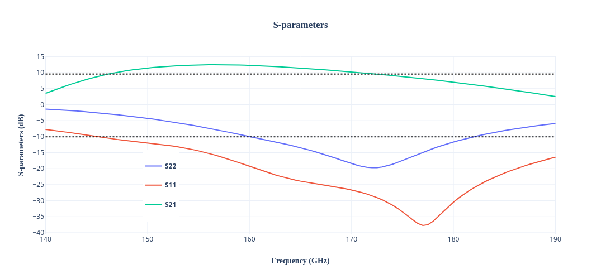

Design data and design process description
############################################

Schematic: Qucs-s 24.4.1

Simulator: Ngspice 44

**Simulated Noise Figure(NF) and Minimimum Noise Figure (NFmin):**

.. image:: _static/NF.png
    :align: center
    :alt: S-parameters Image.
    :width: 800

NFmin and NF both are less than 6 dB

**Simulated S-parameters:**

**Simulated 1-dB compression point:**

.. image:: _static/Compression.png
    :align: center
    :alt: S-parameters Image.
    :width: 800    