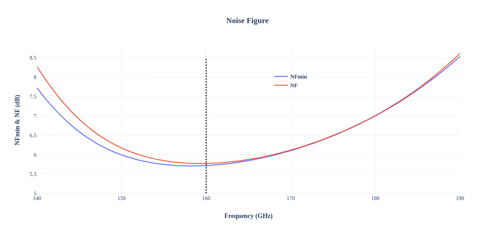
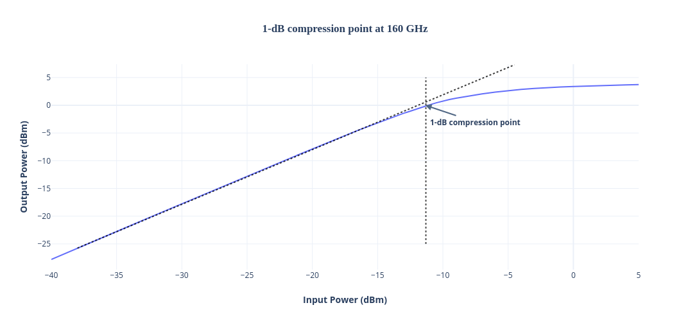

Design data and design process description
############################################

Schematic: Qucs-s 24.4.1

Simulator: Ngspice 44

**Simulated S-parameters:**

NFmin and NF both are less than 6 dB

