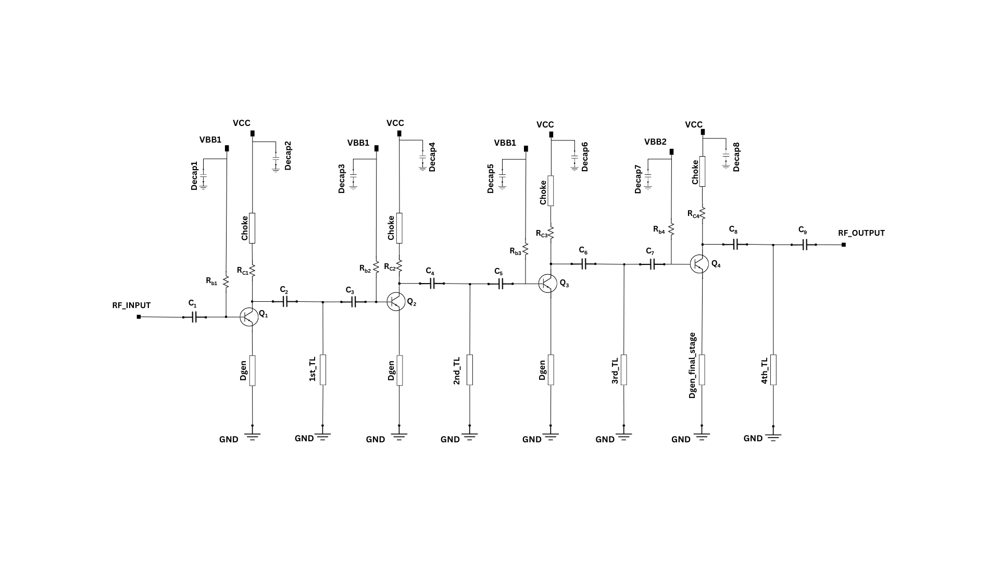

A 160 GHz Low Noise Amplifier with 27-GHz Bandwidth
###################################################

.. list-table:: **Specification**
   :widths: 400 200
   :header-rows: 1

   * - Specification
     - Value
   * - Bandwidth
     - 146 GHz to 173 GHz
   * - Noise Figure at 160 GHz
     - 5.77 dB
   * - Peak Gain at 157 GHz
     - 12.5 dB
   * - Topology
     - Common Emitter (Cascade)
   * - Input Referred 1dB compression point at 160 GHz
     - -11.4 dBm
   * - Output Referred 1dB compression point at 160 GHz
     - -0.12 dBm
   * - Power Consumption
     - 15.94 mW

 
**Schematic:**

.. list-table:: **DC Voltages**
   :widths: 200 200 200
   :header-rows: 1

   * - VCC
     - VBB1
     - VBB2
   * - 1.35 V
     - 0.9 V
     - 0.93 V

.. list-table:: **Capacitor Values**
   :widths: 200 100 200 100
   :header-rows: 1

   * - Parameter
     - Type
     - Size 
     - Value
   * - C\ :sub:`1`
     - rfcmim
     - 15×10 um\ :sup:`2`
     - 227 fF
   * - C\ :sub:`2`
     - rfcmim
     - 3.72×32 um\ :sup:`2`
     - 182 fF
   * - C\ :sub:`3`
     - rfcmim
     - 2.4×5.2 um\ :sup:`2`
     - 19.4 fF
   * - C\ :sub:`4`
     - rfcmim
     - 3.72×32 um\ :sup:`2`
     - 182 fF
   * - C\ :sub:`5`
     - rfcmim
     - 2.5×7.6 um\ :sup:`2`
     - 29.5 fF
   * - C\ :sub:`6`
     - rfcmim
     - 12.5×32 um\ :sup:`2`
     - 604 fF
   * - C\ :sub:`7`
     - rfcmim
     - 2.4×5.1 um\ :sup:`2`
     - 19.1 fF
   * - C\ :sub:`8`
     - rfcmim
     - 6.2×32 um\ :sup:`2`
     - 301 fF   
   * - C\ :sub:`9`
     - rfcmim
     - 2.4×3.2 um\ :sup:`2`
     - 12.1 fF   
   * - Decap1 (multiplier=2)
     - cmim
     - 20×25 um\ :sup:`2`
     - 750 fF      

*N.B:-All Decap values are same (Decap1=Decap2=Decap3=Decap4=Decap5=Decap6=Decap7=Decap8)*
  .. list-table:: **Resistor Values**
   :widths: 200 100 200 100
   :header-rows: 1

   * - Parameter
     - Type
     - Size 
     - Value
   * - R\ :sub:`c1`
     - rsil
     - 7.5×5 um\ :sup:`2`
     - 5.86 Ω
   * - R\ :sub:`c2`
     - rsil
     - 7.5×5 um\ :sup:`2`
     - 5.86 Ω
   * - R\ :sub:`c3`
     - rsil
     - 7.5×5 um\ :sup:`2`
     - 5.86 Ω
   * - R\ :sub:`c4`
     - rsil
     - 7.5×5.5 um\ :sup:`2`
     - 6.33 Ω
   * - R\ :sub:`b1`
     - rhigh
     - 1.9×6 um\ :sup:`2`
     - 4471.307 Ω
   * - R\ :sub:`b2`
     - rhigh
     - 1.9×5 um\ :sup:`2`
     - 3740.125 Ω   
   * - R\ :sub:`b3`
     - rhigh
     - 1.9×6 um\ :sup:`2`
     - 4471.307 Ω   
   * - R\ :sub:`b4`
     - rhigh
     - 2×6 um\ :sup:`2`
     - 4243.265 Ω       

  .. list-table:: **Transmission Line Values**
   :widths: 200 100 
   :header-rows: 1

   * - Parameter
     - Length
   * - Choke
     - 175 um
   * - Dgen
     - 89 um
   * - Dgen_final_stage
     - 55 um
   * - 1st_TL
     - 103 um 
   * - 2nd_TL
     - 130 um    
   * - 3rd_TL
     - 130 um 
   * - 4th_TL
     - 106 um 
     
    
  **Layout:**

  .. image:: _static/Layout.png
    :align: center
    :alt: Schematic Image.
    :width: 800 

  .. list-table:: **State-of-art comparison:**
   :widths: 100 100 100 100 100 100 
   :header-rows: 1

   * - Reference
     - Technology
     - Frequency (GHz)
     - Gain (dB)
     - Noise Figure (dB)
     - Input-Referred P\ :sub:`1dB` (dBm)
   * - `[1] <https://ieeexplore.ieee.org/abstract/document/8923164>`_
     - 130 nm BiCMOS
     - 180 
     - 19
     - 7.1
     - -30 
   * - `[2] <https://ieeexplore.ieee.org/abstract/document/7576648>`_
     - 130 nm SiGe BiCMOS
     - 158
     - 24.1
     - 8.2
     - -25.9
   * - `[3] <https://ieeexplore.ieee.org/abstract/document/10734357>`_
     - 130 nm SiGe BiCMOS
     - 160.5
     - 15.6
     - 9.8
     - N/A
   * - This Work
     - 130 nm SiGe BiCMOS
     - 160
     - 12.3 (peak:12.5)
     - **5.77**
     - -11.4 
        

