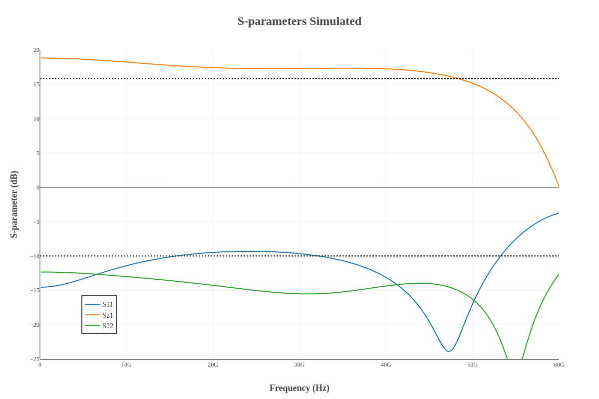
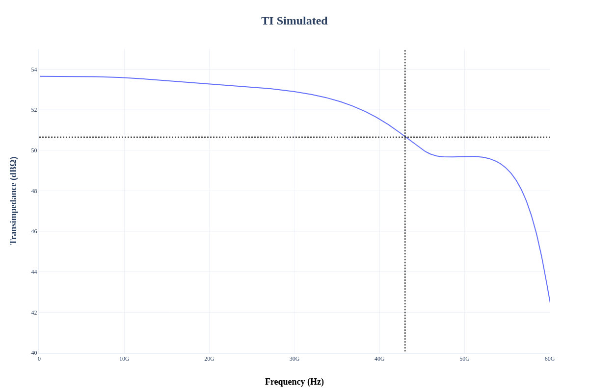
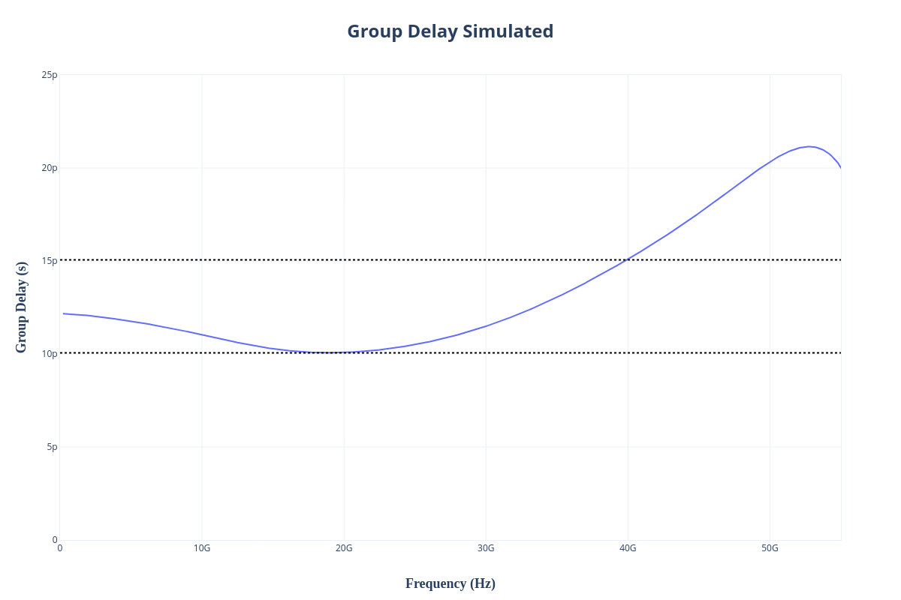
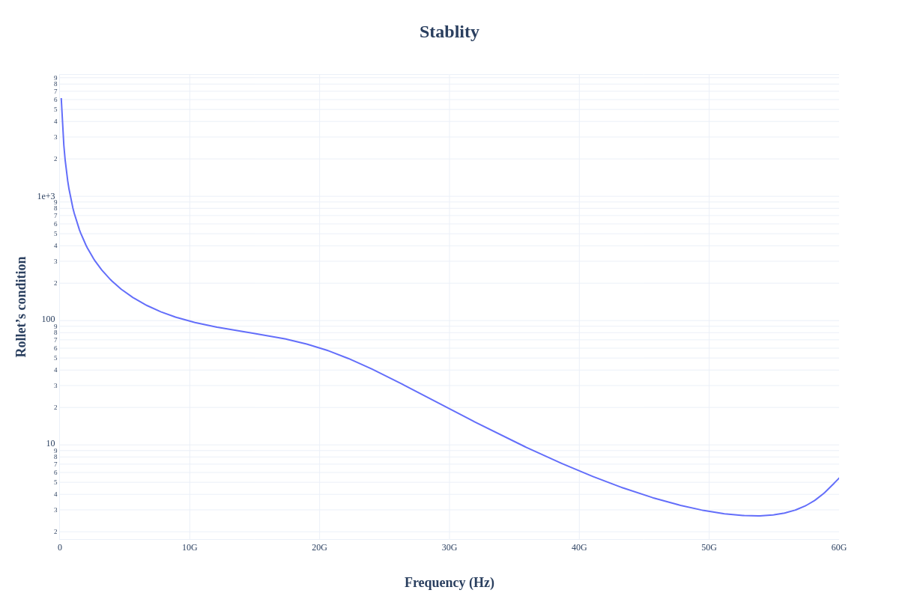
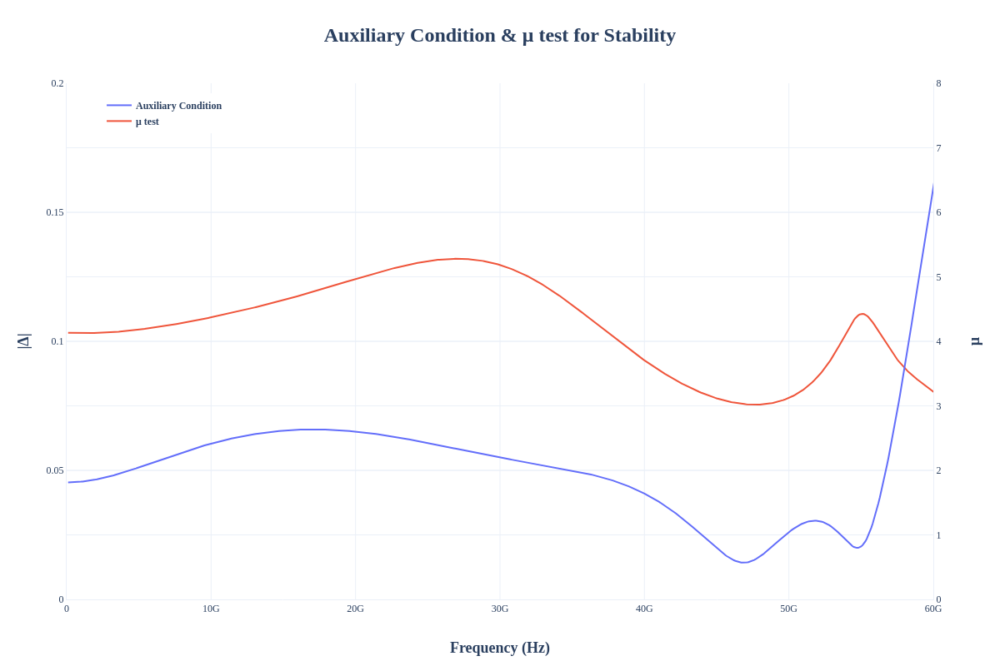
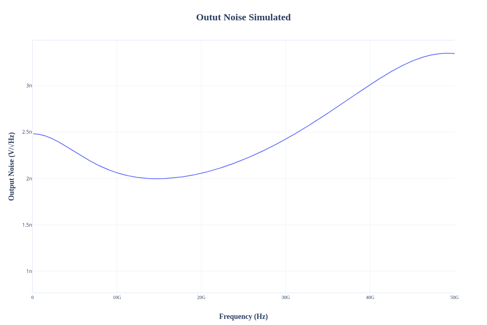
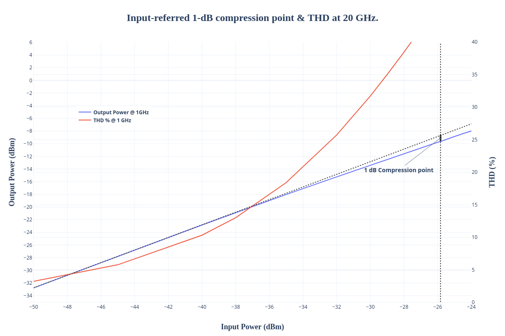

Design data and design process description
############################################

Schematic: Qucs-s 24.4.1

Simulator: Ngspice 44.2

**Simulated S-parameters:**

The input and output matching is better than −10 dB within the
bandwidth.

**Simulated Transimpedance:**

**Simulated Group Delay:**

**Simulated Rollet's Condition for stability:**

**Simulated Auxiliary Condition and µ-test for stability:**

**Simulated Output Noise Spectral Density:**

**Simulated Input-referred 1-dB compression point & THD at 20 GHz:**

