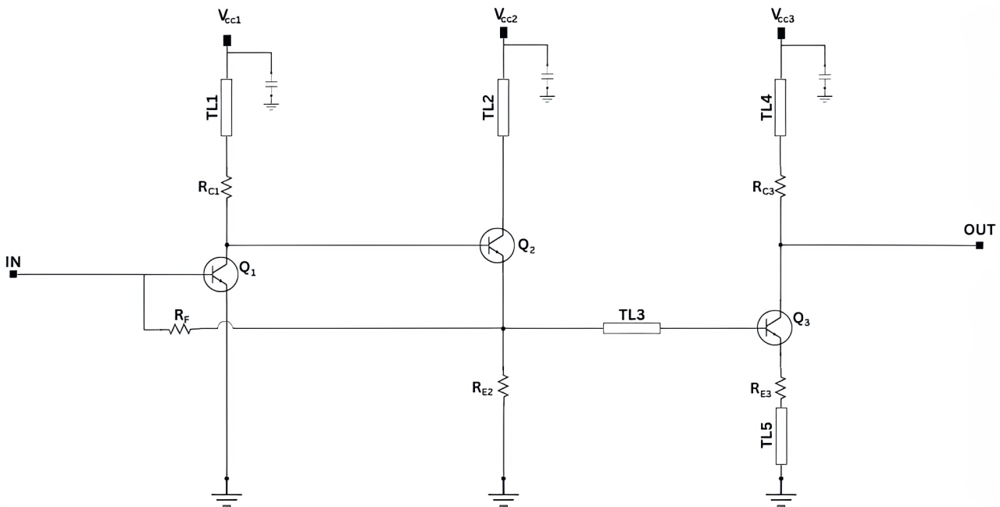
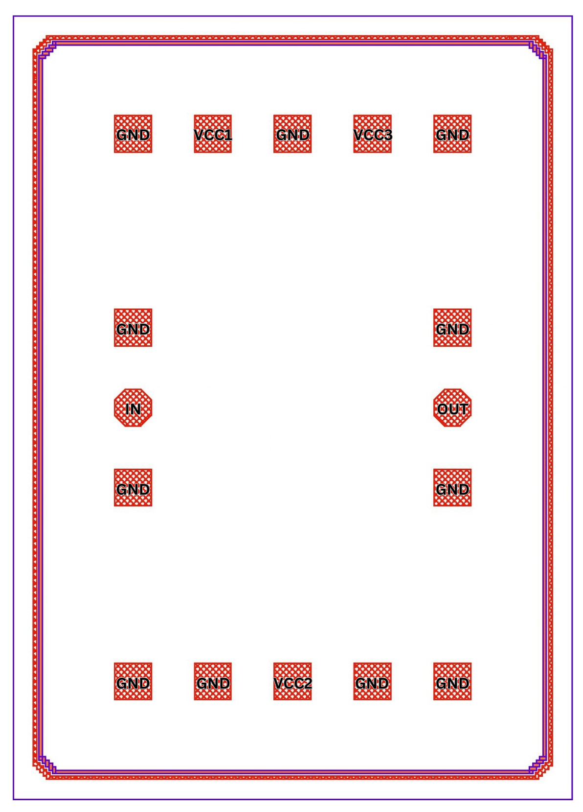

Specification of the Transimpedance Amplifier
##############################################

.. list-table:: **Specification**
   :widths: 600 200
   :header-rows: 1

   * - Specification
     - Value
   * - Bandwidth
     - 0 to 40 GHz
   * - Transimpedance
     - 55 dBΩ
   * - Gain
     - 18.8 dB
   * - Group Delay Variation
     - 5 ps
   * - Phase Deviation from Linear Phase
     - ±4°
   * - Average Input Reffered Current Noise Density
     - 9.5 pA/√Hz
   * - Power Cosumption
     - 10.22 mW
     

.. list-table:: **DC Voltages**
   :widths: 266 266 266
   :header-rows: 0

   * - VCC1
     - VCC2
     - VCC3
   * - 2.1 V
     - 2.1 V
     - 1.7 V

**Schematic:**

.. list-table:: **Components Values**
   :widths: 300 100 300 100
   :header-rows: 1

   * - Parameter
     - Value
     - Parameter
     - Value
   * - TL1
     - 570 µm
     - R\ :sub:`E2`
     - 540 Ω
   * - TL2
     - 530 µm
     - R\ :sub:`C3`
     - 30 Ω
   * - TL3
     - 290 µm
     - R\ :sub:`E3`
     - 8 Ω
   * - TL4
     - 450 µm
     - Q\ :sub:`1`
     - 10×70×900 nm\ :sup:`2`
   * - TL5
     - 20 µm
     - Q\ :sub:`2`
     - 5×70×900 nm\ :sup:`2`
   * - R\ :sub:`F`
     - 880 Ω
     - Q\ :sub:`3`
     - 10×70×900 nm\ :sup:`2`
   * - R\ :sub:`C1`
     - 155 Ω
     -
     -

**Layout:**

**Layout Size: 700 µm × 980 µm**