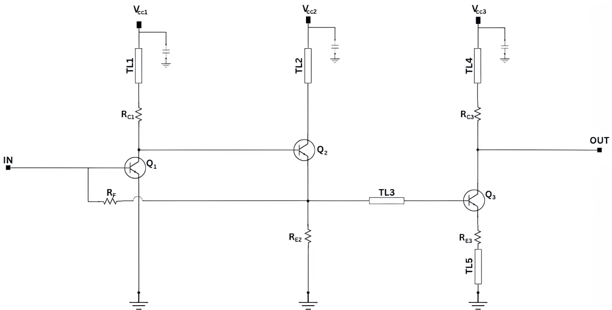
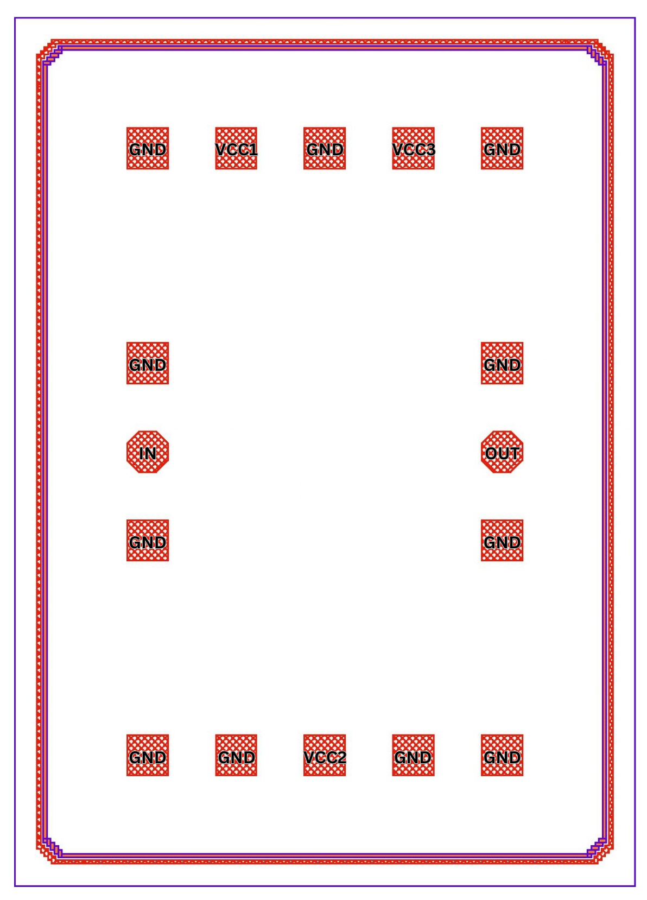

A Low-Noise Single Ended TIA With 40-GHz Bandwidth
###################################################

.. list-table:: **Specification**
   :widths: 400 200
   :header-rows: 1

   * - Specification
     - Value
   * - Bandwidth
     - 0 to 97 GHz
   * - Transimpedance
     - 59.2 dBΩ
   * - Gain
     - 22.1 dB
   * - Group Delay Variation
     - ±4 ps
   * - Average Input Referred Current Noise Density
     - 17 pA/√Hz
   * - Power Consumption
     - 11.67 mW
     

.. list-table:: **DC Voltages**
   :widths: 200 200
   :header-rows: 0

   * - VCC1
     - VCC2
   * - 3.3 V
     - 3.3 V

**Schematic:**

.. list-table:: **Components Values**
   :widths: 200 100 200 100
   :header-rows: 1

   * - Parameter
     - Value
     - Parameter
     - Value
   * - TL1
     - 570 µm
     - R\ :sub:`E2`
     - 540 Ω
   * - TL2
     - 530 µm
     - R\ :sub:`C3`
     - 30 Ω
   * - TL3
     - 290 µm
     - R\ :sub:`E3`
     - 8 Ω
   * - TL4
     - 450 µm
     - Q\ :sub:`1`
     - 10×70×900 nm\ :sup:`2`
   * - TL5
     - 20 µm
     - Q\ :sub:`2`
     - 5×70×900 nm\ :sup:`2`
   * - R\ :sub:`F`
     - 880 Ω
     - Q\ :sub:`3`
     - 10×70×900 nm\ :sup:`2`
   * - R\ :sub:`C1`
     - 155 Ω
     -
     -

**Layout:**

**Layout Size: 700 µm × 980 µm**

.. list-table:: **State-of-art comparison:**
   :widths: 100 100 100 100 100 100
   :header-rows: 1

   * - Reference
     - Process
     - BW (GHz)
     - Z\ :sub:`T` (dBΩ)
     - Noise (pA/√Hz)
     - Power (mW)
   * - `[1] <https://ieeexplore.ieee.org/abstract/document/8194885>`_
     - 130 nm BiCMOS
     - 75
     - 54
     - 10.9
     - 95
   * - `[2] <https://ieeexplore.ieee.org/abstract/document/10659112>`_
     - 130 nm SiGe BiCMOS
     - 42
     - 74
     - 12.5
     - 238
   * - `[3] <https://ieeexplore.ieee.org/abstract/document/10665896>`_
     - 90 nm SiGe BiCMOS
     - 40
     - 75
     - 15.1
     - 264
   * - This Work
     - 130 nm SiGe BiCMOS
     - 40
     - 55
     - **9**
     - 11.67