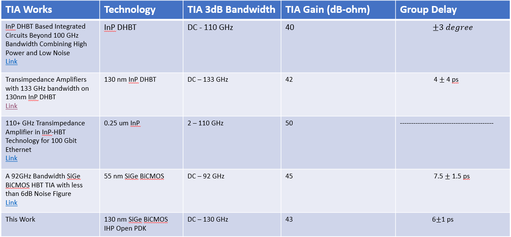

Specification of the DC to 130 GHz Bandwidth transimpedance Amplifier Design
#################################################################################

.. list-table:: Design Specification
   :widths: 40 40
   :header-rows: 1

   * - Design Data
     - Value/Parameter
   * - Transimpedance 3dB bandwidth
     -  ≥ 130 GHz
   * - S21 3dB bandwidth
     - ≈ 130 GHz
   * - S21 Gain
     -  ≥ 10 dB
   * - S11 & S22
     - ≤ -10 dB
   * - Group Delay
     - ≤ 8 ps
   * - Transimpedance Gain
     - ≥ 40 dB-ohm

Comparison with other state of the art designs
----------------------------------------------------

