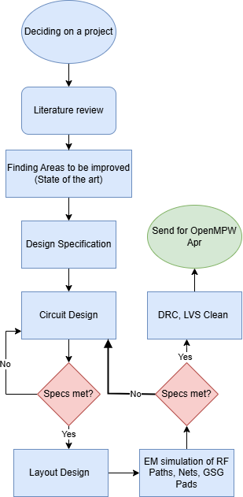

Design data and design process description
############################################

The design procedure can be explained with a flow chart -

Initial Phase
----------------------------------------------

The primary focus was to design a state of the art transimpedance amplifier at least in one aspect. 
The bandwidth was chosen as the primary focus thus TIA dB-Ohm and S21 bandwidth were taken into consideration. 
As of this tapeout, the highest bandwidth achieved by a transimpdeance amplifier design was 110 GHz. So the goal was set to design a DC - 130 GHz TIA 
which would be the highest bandwidth in a SiGe process. Comparison of the other works can be found in the specification file.

Literature review
---------------------------

Please kindly refer to the specification specification

