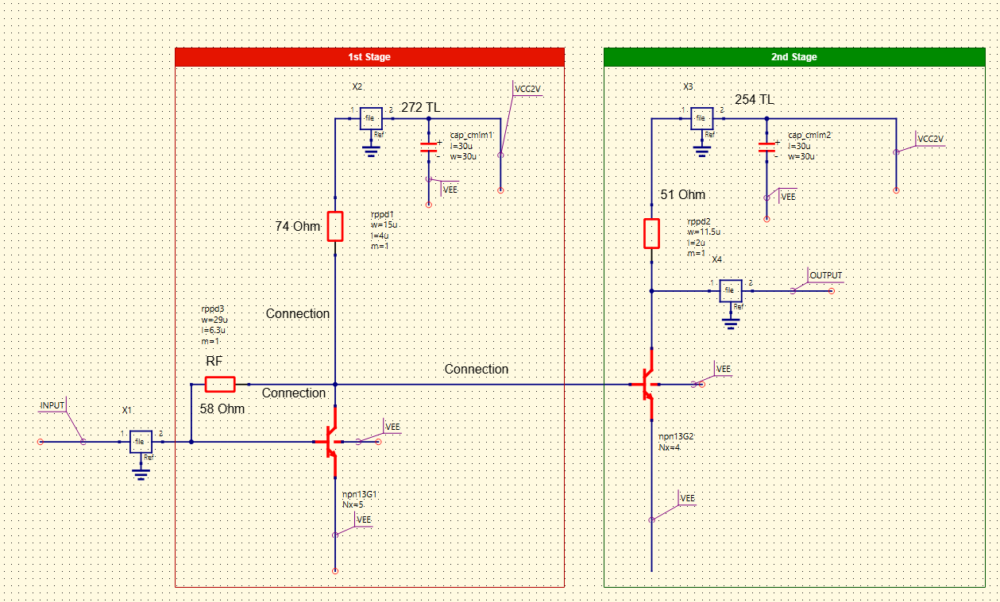
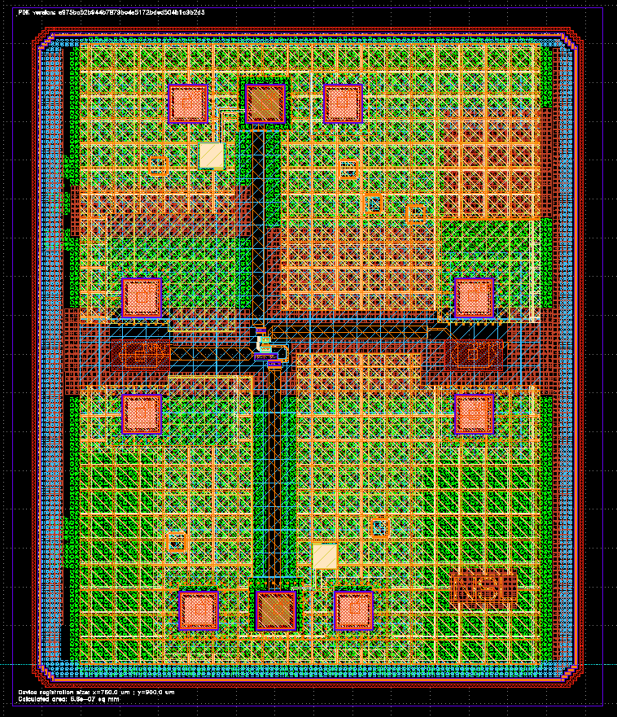
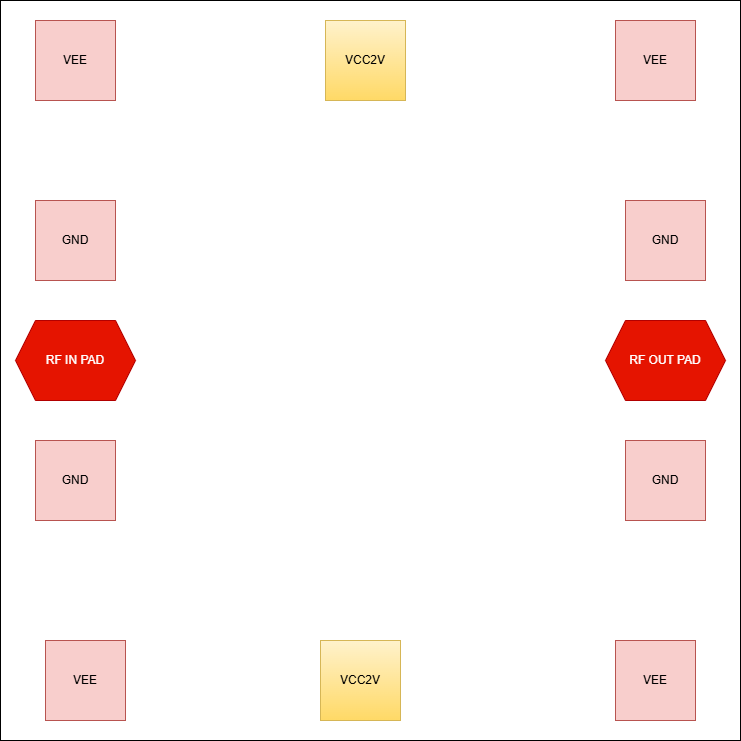
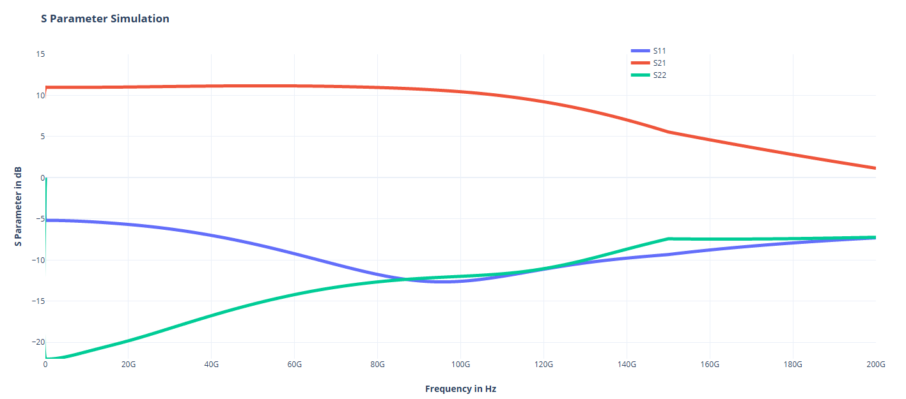
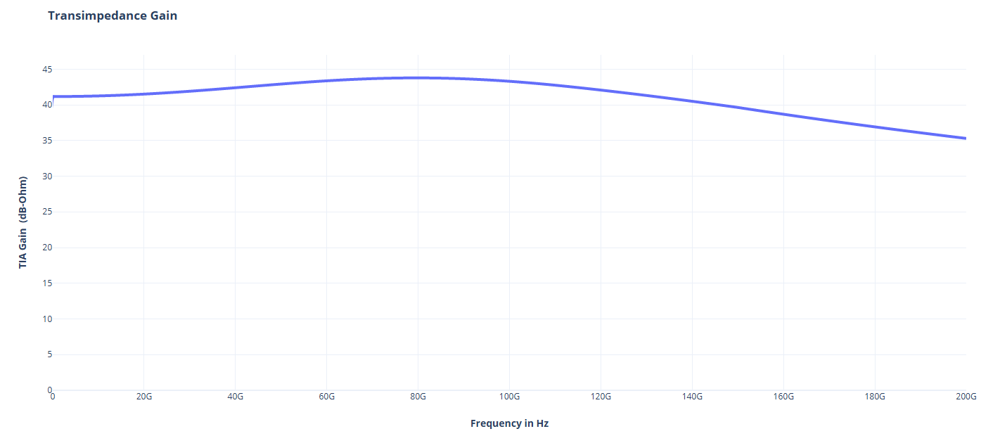
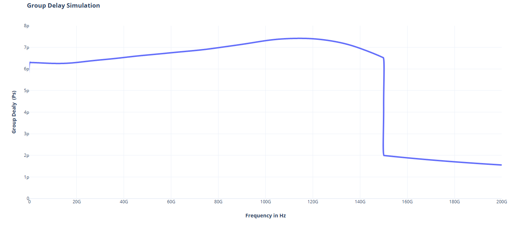
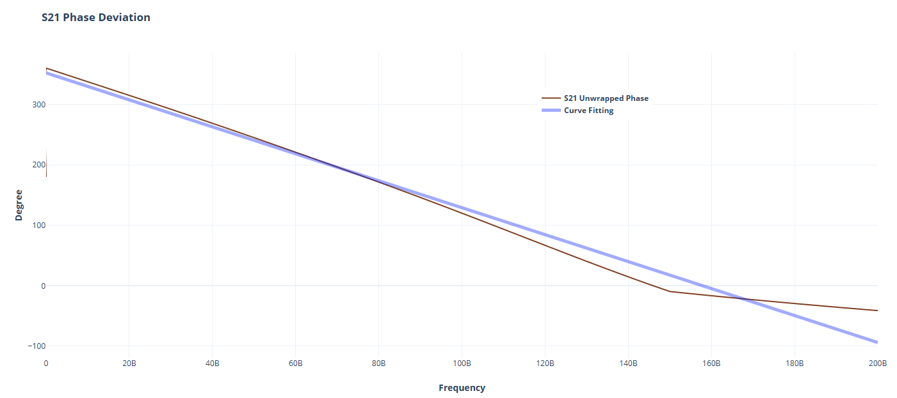
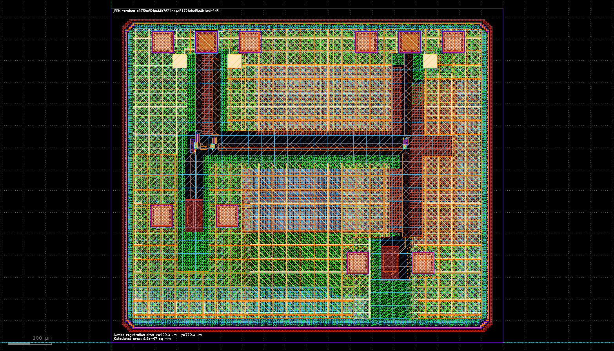
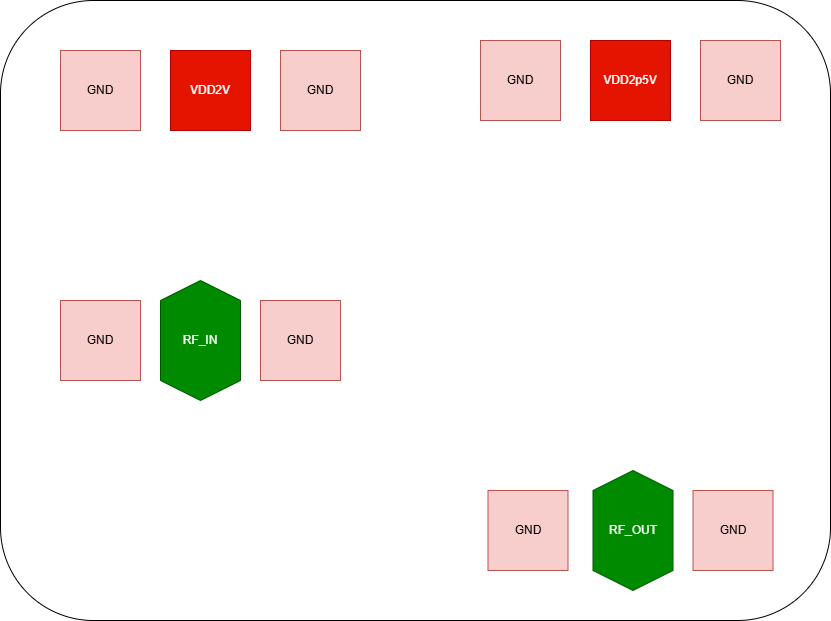

Design data and design process description
############################################

The design procedure can be explained with a flow chart -

.. image:: _static/flowchart.png
    :align: center
    :width: 600
    :height: 800

Design Procedure
##############################################

As shown in the flowchart, the primary focus was to design a state of the art transimpedance amplifier at least in one aspect. 
The bandwidth was chosen as the primary focus thus TIA dB-Ohm and S21 bandwidth were taken into consideration.  
As of this tape-out, literature review shows that the highest bandwidth achieved by a transimpdeance amplifier design was 110 GHz. Other technologies (e.g. InP, GaAs, etc.) may have higher bandwidth capacity 
so the goal was set to design a DC - 130 GHz TIA  which would be the highest bandwidth in a SiGe process. 
Comparison of the other works can be found in the specification file.

Circuit Design 
----------------------------------------------

The schematic capture of the circuit is shown below - 

The circuit topology is as follows -

1st Stage 
------------------------

The 1st stage is a resistive feedback common emitter amplifier which primarily gives the transimpedance gain. The feedback resistor RF is responsible for it.
The 1st stage uses a 5 emitter length npn13G2 HBT. Another resistor in series with a 272 um TL line gives a peaking response. This stage sets the S21 and TIA dB-Ohm 
gain.

.. list-table:: Design Data of 1st stage
   :widths: 40 40
   :header-rows: 1

   * - Design Data
     - Value/Parameter
   * - Emitter Length
     - 5
   * - Feedback resistor, RF
     - 58 Ohm
   * - Collector resistor, Rc 
     - 74 Ohm
   * - Transmission line
     - 272 um    
   * - Supply voltage, VCC
     - 2 V 
   * - Decoupling capacitor
     - 1 pF

2nd stage
--------------------------------------

The 2nd stage is a simple common emitter amplifier which further enhances the bandwidth of the S21 & transimpedance gain.
Here, a 4 emitter length npn13G2 hbt, 254 um TL line and a 51 ohm load resistor have been used.

.. list-table:: Design Data of 2nd stage
   :widths: 40 40
   :header-rows: 1

   * - Design Data
     - Value/Parameter
   * - Emitter Length
     - 4
   * - Collector resistor, Rc 
     - 51 Ohm
   * - Transmission line
     - 254 um    
   * - Supply voltage, VCC
     - 2 V 
   * - Decoupling capacitor
     - 1 pF

Layout Design
----------------------------------------

The complete layout view -

Pin out view -

.. list-table:: Layout data
   :widths: 40 40
   :header-rows: 1

   * - Design Data
     - Value/Parameter
   * - Area
     - 6.8e-07 sq mm ( 760 mm X 900 um)
   * - RF Signal Pad Dimension
     - 30 X 57 sq um
   * - GND/VEE Pad Dimension
     - 50 um X 50 um
   * - Pad Pitch
     - 75 um
   * - Input Pad to Core TL line
     - 100    
   * - Output Pad to Core TL line
     - 200 um

Simulated Result
###########################################################

S Parameter
------------------------------------

Transimpedance gain
----------------------------------------------

Group Delay
---------------------------------------------

S21 Unwrapped Phase
-------------------------------------

Z21 Simulation
-----------------------------------------

.. image:: _static/z21.PNG
    :align: center
    :width: 1000
    :height: 400

Design of a Second 3-Stage amplifier
##############################################

A 2nd amplifier has been designed with similar specs but this time the amplifier has 3 stages.
As mentioned earlier, this also satisfies the condition to be a state of the art design as it exceeds bandwidth of 130 GHz.
The design has 3 stages with the primary stage giving the transimpedance gain and the rest of the stages are for extending
the bandwidth.

The pin-out of the design 

