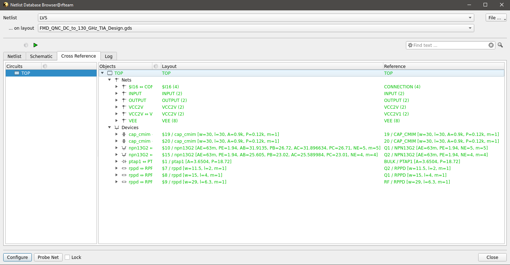
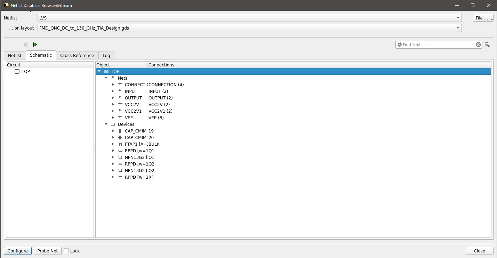

Validation  of the Design
#################################

The design is valid because verification has been done through both DRC and LVS checks.

DRC checks
---------------------------

The drc results for both minimal and maximal rule files have shown that there is 0 drc errors.

Minimal DRC Check - 

Maximal DRC Check - 

LVS Check
-----------------------------

The LVS result is shown below. The lvs result of cross-reference checking, circuit netlist connection are shown below- 

Top cell cross-reference-

 

Circuit TOP lvs check-

Electromagnetic Simulation
-------------------------------------------

All transmission lines, ground signal ground pads and critical path of connections have been subject to em simulation from gds file generating a s2p 
file. This file is used in schematic for verifying the results.

.. image:: _static/openEMS.PNG
    :align: center
    :width: 1600

Measurement result
###############################################

The measured results will be updated once test results are in hand.