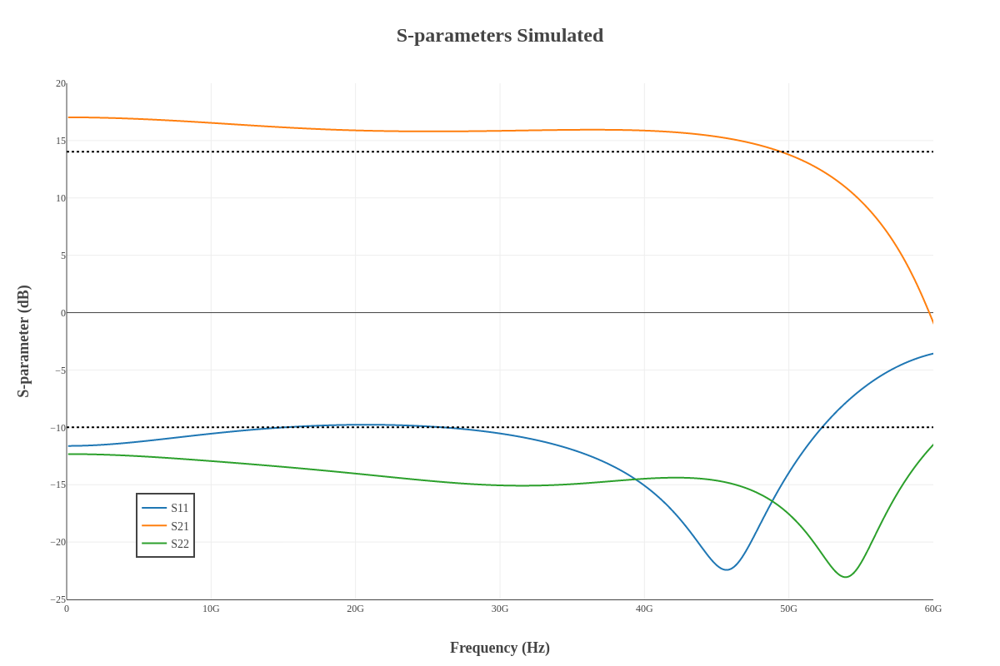

Design data and design process description
############################################

**Simulated S-parameters**

**Simulated Transimpedance**

.. image:: _static/TI_imulated.png
    :align: center
    :alt: Transimpedance Image.
    :width: 800

**Simulated Group Delay:**

