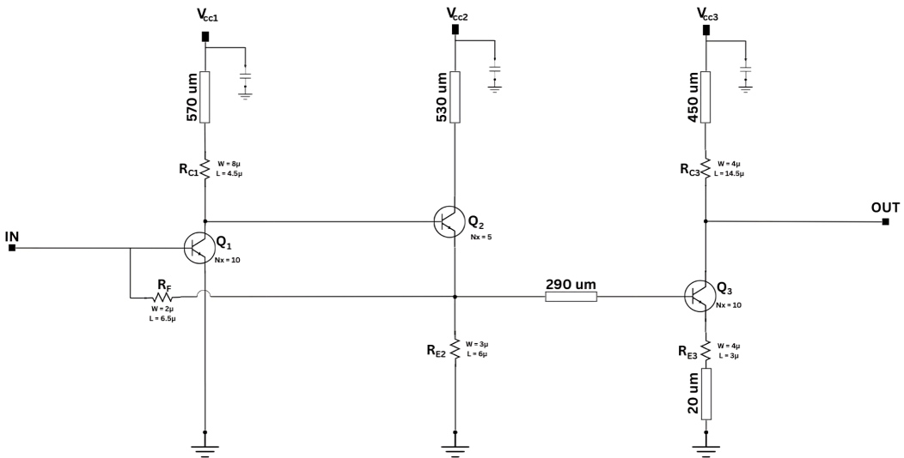
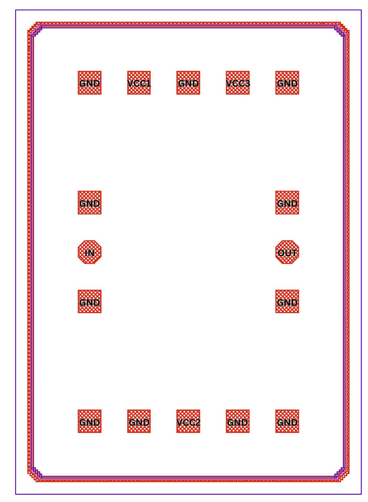

Specification of the Transimpedance Amplifier
##############################################

.. list-table:: **Specification**
   :widths: 150 50
   :header-rows: 1

   * - Specification
     - Value
   * - Bandwidth
     - 0 to 40 GHz
   * - Transimpedance
     - 53.7 dBΩ
   * - Gain
     - 17 dB
   * - Group Delay Variation
     - 5 ps
   * - Phase Deviation from Linear Phase
     - ±4°
   * - Average Input Reffered Noise Current
     - 9.5 pA/√Hz
   * - Power Cosumption
     - 10.22 mW

**Schematic:**

**Layout:**

.. list-table:: **DC Voltages**
   :widths: 150 50
   :header-rows: 0

   * - VCC1
     - 2 V
   * - VCC 2
     - 2.4 V
   * - VCC 3
     - 1.7 V