Design data and design process description
############################################

Layout(KLayout)
***************

Layout for Submission : `gps_lns_fill.gds <https://github.com/noritsuna/GPS_LNA/raw/main/GPS_LNA/design_data/gds/gps_lns_fill.gds>`_
======================================================================================

This layout is filled with filler script in the layout for submission. 

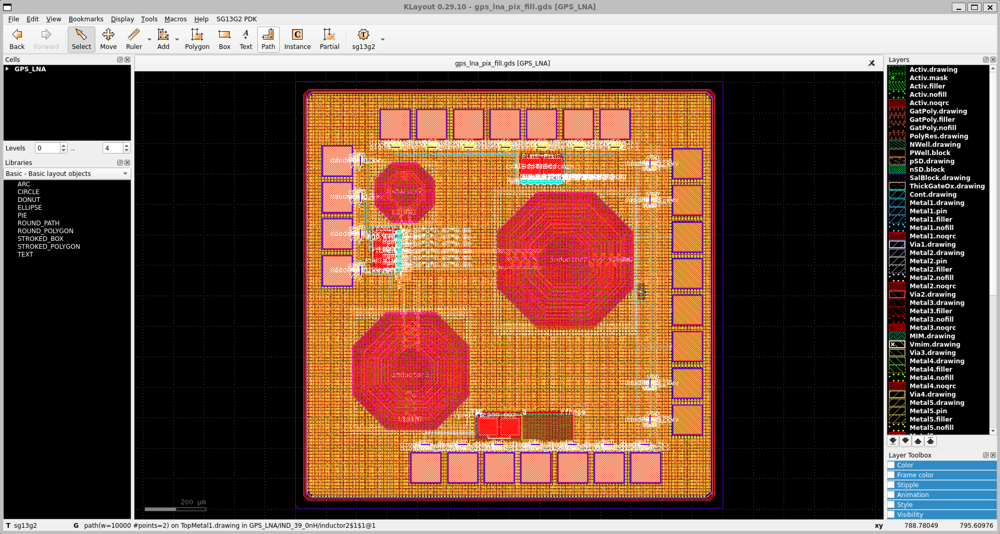

Layout without Filler : `gps_lns.gds <https://github.com/noritsuna/GPS_LNA/raw/main/GPS_LNA/design_data/klayout/gps_lns.gds>`_
================================================================================

This layout is the layout before filling with filler scripts. 

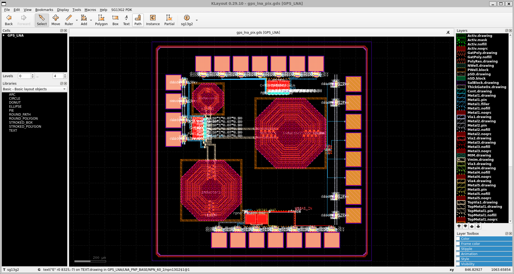

Circuit Schematic(xschem)
*************************

NPN based LNA with Inductor : `lna_full_base.sch <https://github.com/noritsuna/GPS_LNA/raw/main/GPS_LNA/design_data/xschem/lna_full_base.sch>`_
=================================================================================================

The first circuit is a single-ended LNA with NPN transistors. 

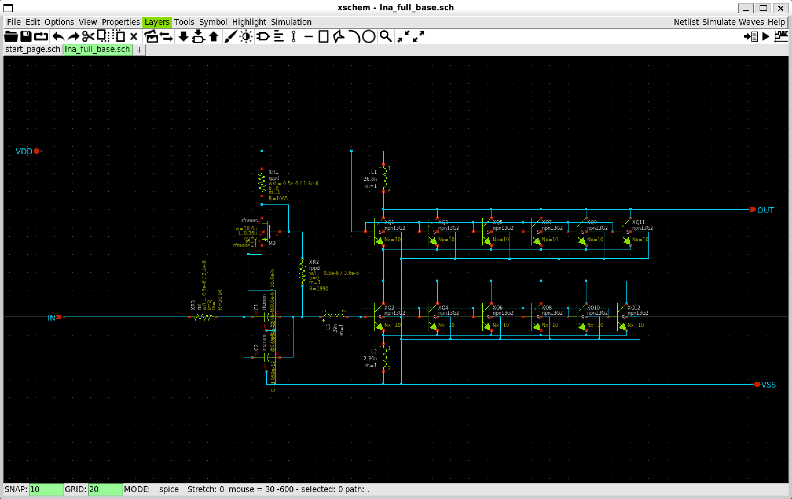

NPN based LNA with Inductor & ESD Pad : `lna_full_pad.sch <https://github.com/noritsuna/GPS_LNA/raw/main/GPS_LNA/design_data/xschem/lna_full_pad.sch>`_
=========================================================================================================

The above circuit with ESD pads attached.This is used in the simulation. 

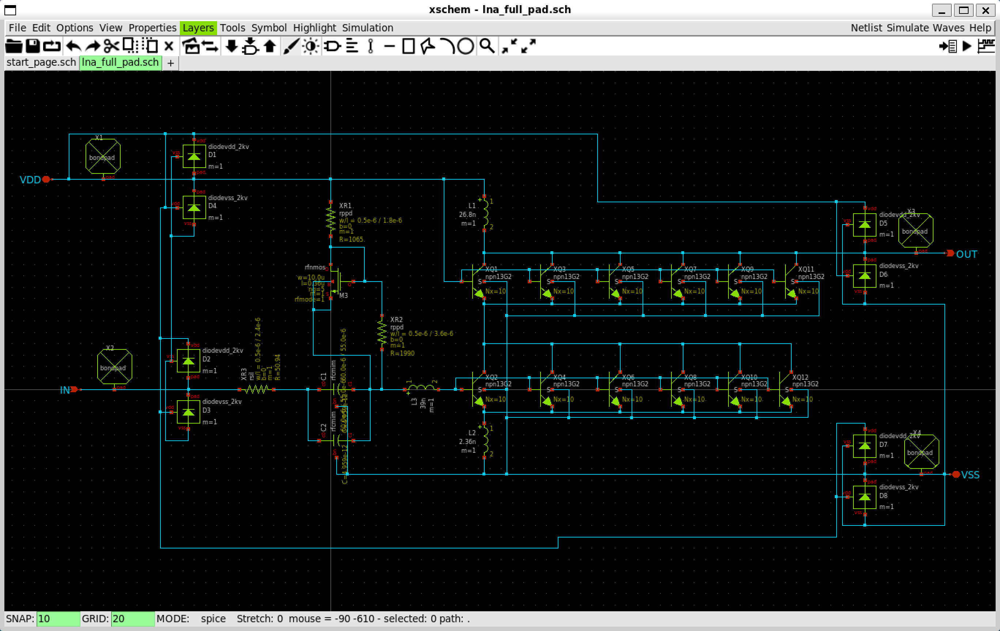

NPN based LNA outside Inductor : `lna_npn_base.sch <https://github.com/noritsuna/GPS_LNA/raw/main/GPS_LNA/design_data/xschem/lna_npn_base.sch>`_
==================================================================================================

This is the second circuit, with the inductor of the first circuit added externally. 

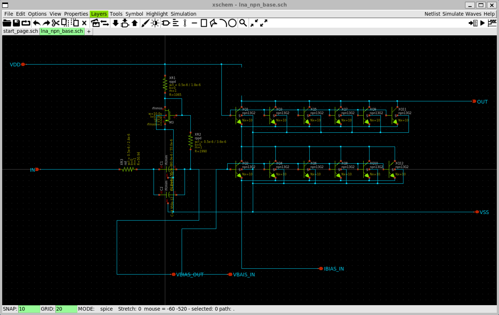

NPN based LNA outside Inductor & ESD Pad : `lna_npn_pad.sch <https://github.com/noritsuna/GPS_LNA/raw/main/GPS_LNA/design_data/xschem/lna_npn_pad.sch>`_
==========================================================================================================

The above circuit with ESD pads attached.This is used in the simulation. 

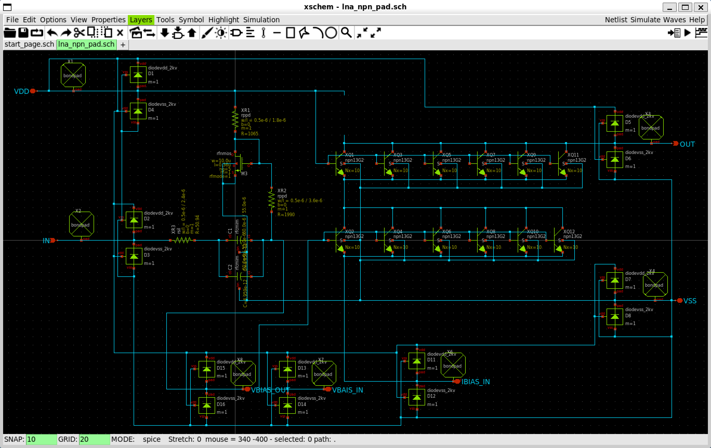

NMOS based LNA without Inductor : `lna_nmos_base.sch <https://github.com/noritsuna/GPS_LNA/raw/main/GPS_LNA/design_data/xschem/lna_nmos_base.sch>`_
=====================================================================================================

This is third circuit, the NPN transistor of the second circuit is replaced by a CMOS one with the same characteristics. 

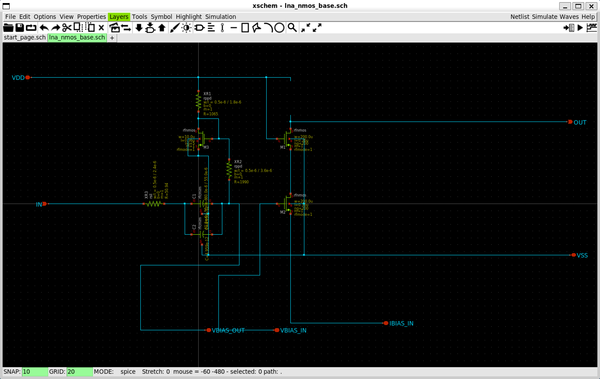

NMOS based LNA without Inductor & ESD Pad : `lna_nmos_pad.sch <https://github.com/noritsuna/GPS_LNA/raw/main/GPS_LNA/design_data/xschem/lna_nmos_pad.sch>`_
=============================================================================================================

The above circuit with ESD pads attached.This is used in the simulation. 

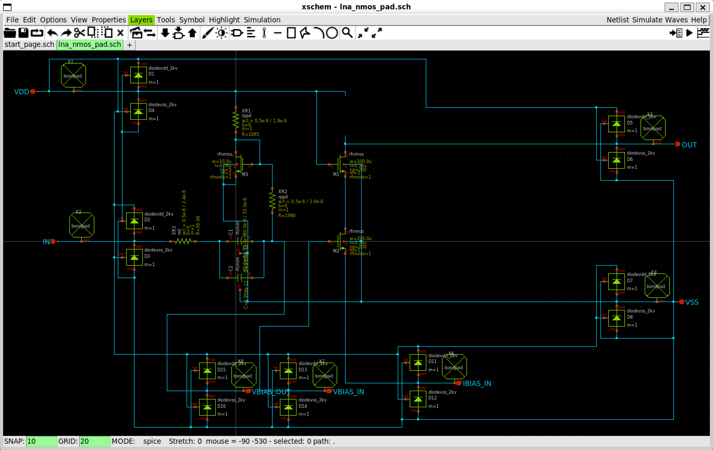

All Circuits : `lna_all_pad.sch <https://github.com/noritsuna/GPS_LNA/raw/main/GPS_LNA/design_data/xschem/lna_all_pad.sch>`_
==============================================================================

The above three circuits are combined into one circuit diagram. 

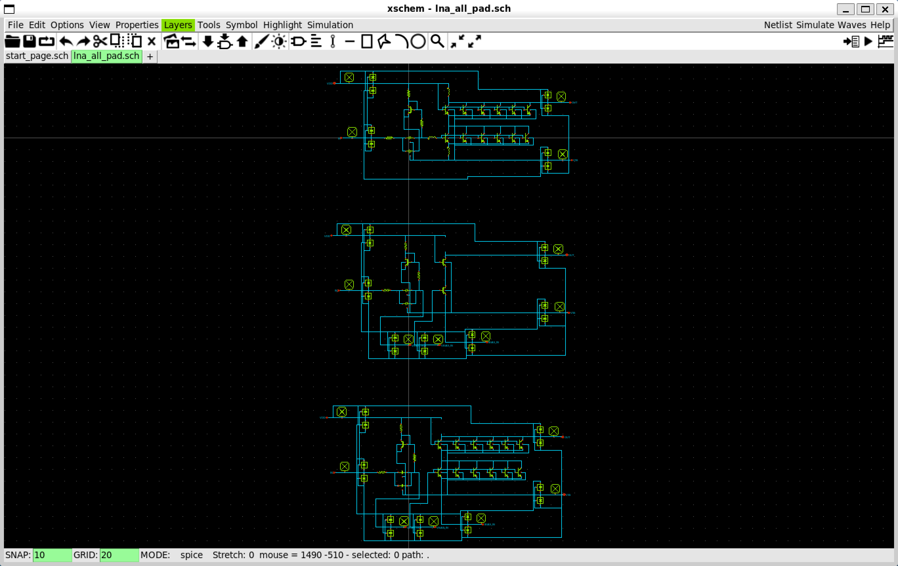

Simulation(xschem + xyce)
*************************

The system was designed as a general GPS system. 

Simulations were also performed on the following circuits. 
#.  NPN-based with built-in inductor
#.  NMOS-based with built-in inductor
#.  NPN-based with external inductor is connected with Pad
#.  NMOS-based with external inductor is connected with Pad

NPN based LNA with Inductor : `lna_tb_xyce_rf_npn.sch <https://github.com/noritsuna/GPS_LNA/raw/main/GPS_LNA/design_data/xyce/lna_tb_xyce_rf_npn.sch>`_
=========================================================================================================

NPN-based with built-in inductor. 

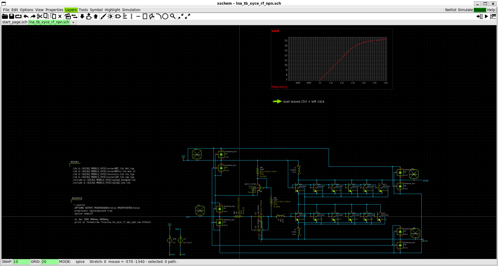

NMOS based LNA with Inductor : `lna_tb_xyce_rf_rfmos.sch <https://github.com/noritsuna/GPS_LNA/raw/main/GPS_LNA/design_data/xyce/lna_tb_xyce_rf_rfmos.sch>`_
==============================================================================================================

NMOS-based with built-in inductor. 

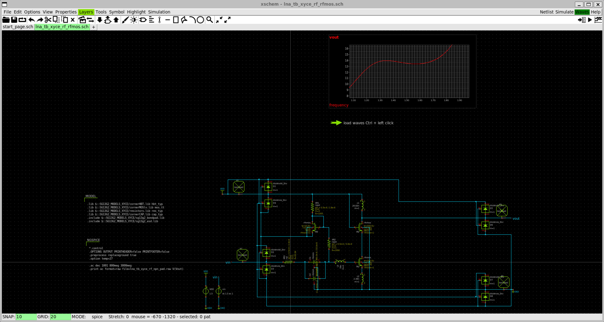

NPN based LNA outside Inductor : `lna_tb_xyce_rf_npn_pad.sch <https://github.com/noritsuna/GPS_LNA/raw/main/GPS_LNA/design_data/xyce/lna_tb_xyce_rf_npn_pad.sch>`_
====================================================================================================================

NPN-based with external inductor is connected with Pad. 

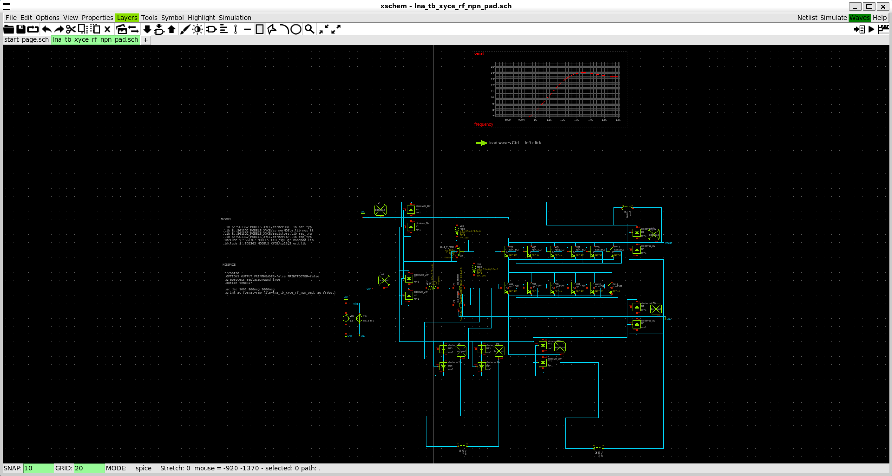

NMOS based LNA outside Inductor : `lna_tb_xyce_rf_rfmos_pad.sch <https://github.com/noritsuna/GPS_LNA/raw/main/GPS_LNA/design_data/xyce/lna_tb_xyce_rf_rfmos_pad.sch>`_
=========================================================================================================================

NMOS-based with external inductor is connected with Pad. 

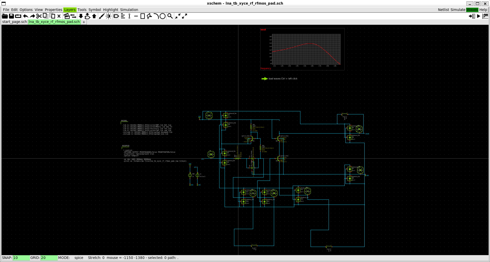

S-Parameters' Simulation(qucs-s + xyce)
******

Coming soon.I am currently debugging a test bench.

NPN based LNA with Inductor : `lna_tb_xyce_rf_npn.sch <https://github.com/noritsuna/GPS_LNA/raw/main/GPS_LNA/design_data/qucs-s/lna_npn_tb.sch>`_
=========================================================================================================

NPN-based with built-in inductor. 

NMOS based LNA with Inductor : `lna_tb_xyce_rf_rfmos.sch <https://github.com/noritsuna/GPS_LNA/raw/main/GPS_LNA/design_data/qucs-s/lna_nmos_tb.sch>`_
==============================================================================================================

NMOS-based with built-in inductor. 

OpenEMS
*******

The inductor was designed using OpenEMS. 
The design specs and S-parameter files are as follows 

2.36nH of Inductor : `S parameter Data <https://github.com/noritsuna/GPS_LNA/tree/main/GPS_LNA/design_data/OpenEMS/ind_2_36nH/>`_
==================================================================================

.. list-table:: Specification
   :widths: 40 40
   :header-rows: 1

   * - Line Width 
     - 5.0u
   * -  Line Spacing
     - 2.1u
   * - Number of Rolls
     - 4N

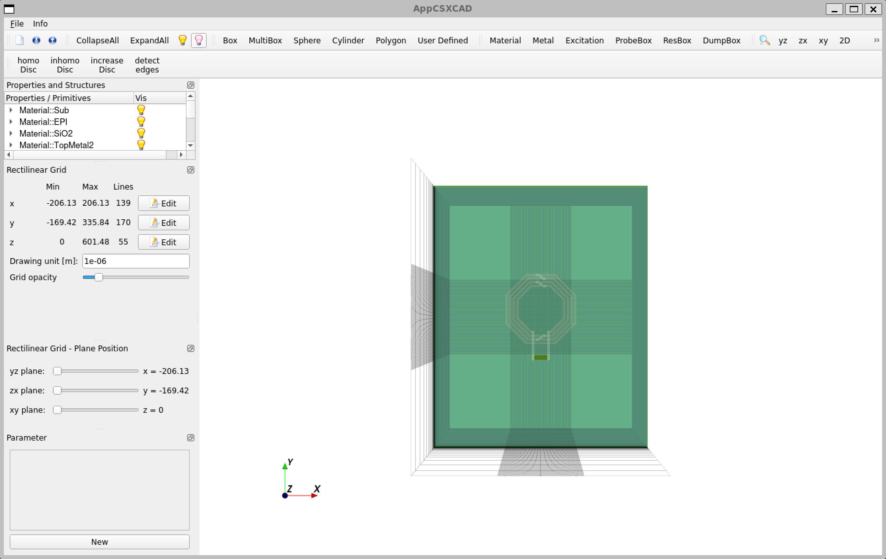

26.83nH of Inductor : `S parameter Data <https://github.com/noritsuna/GPS_LNA/tree/main/GPS_LNA/design_data/OpenEMS/ind_26_83nH/>`_
====================================================================================

.. list-table:: Specification
   :widths: 40 40
   :header-rows: 1

   * - Line Width 
     - 8.0u
   * -  Line Spacing
     - 3.0u
   * - Number of Rolls
     - 9N

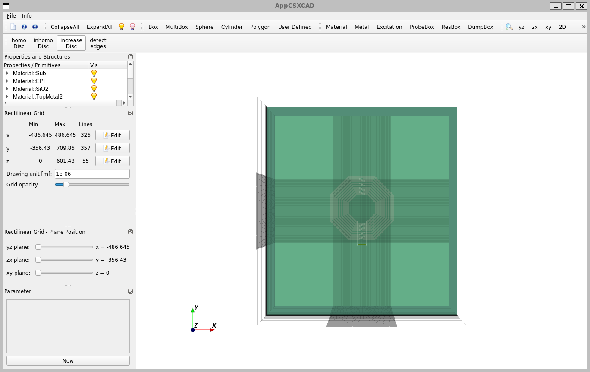

39.00nH of Inductor : `S parameter Data <https://github.com/noritsuna/GPS_LNA/tree/main/GPS_LNA/design_data/OpenEMS/ind_39_00nH/>`_
====================================================================================

.. list-table:: Specification
   :widths: 40 40
   :header-rows: 1

   * - Line Width 
     - 10.0u
   * -  Line Spacing
     - 3.0u
   * - Number of Rolls
     - 9N

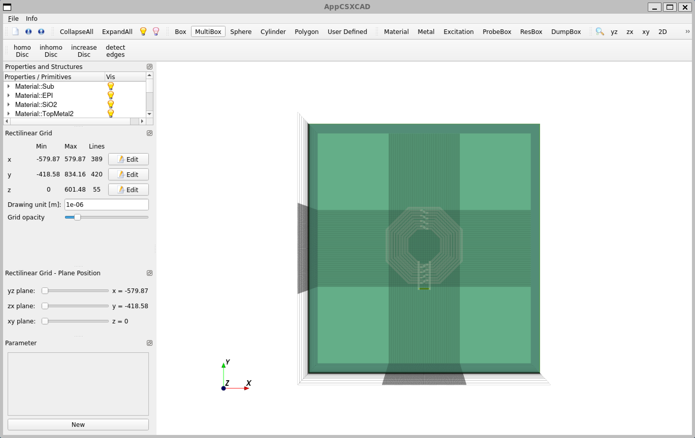

