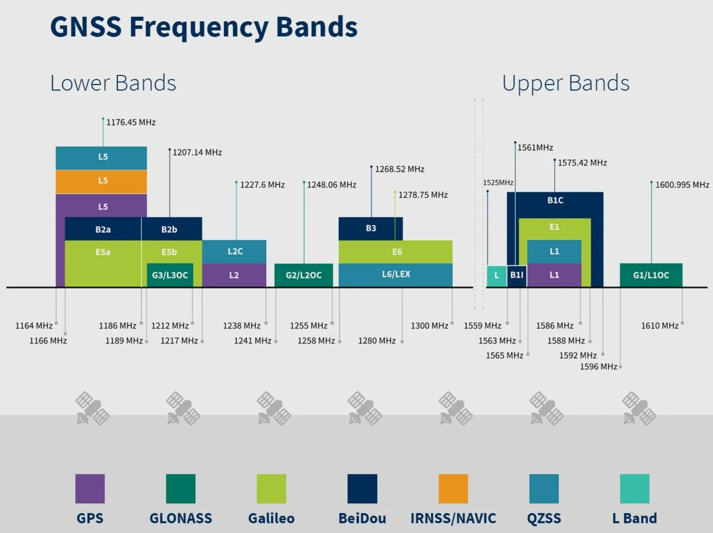

Specification of the LNA for GPS
################################

GPS Specification
*****************

The system was designed as a general GPS system. 

.. list-table:: Specification
   :widths: 40 40
   :header-rows: 1

   * - Band Range
     - 1.1GHz - 1.6GHz
   * - Gain
     - 20dBm
   * - NF
     - -dBm

- https://www.taoglas.com/jp/understanding-gnss-what-it-is-and-how-it-works/
