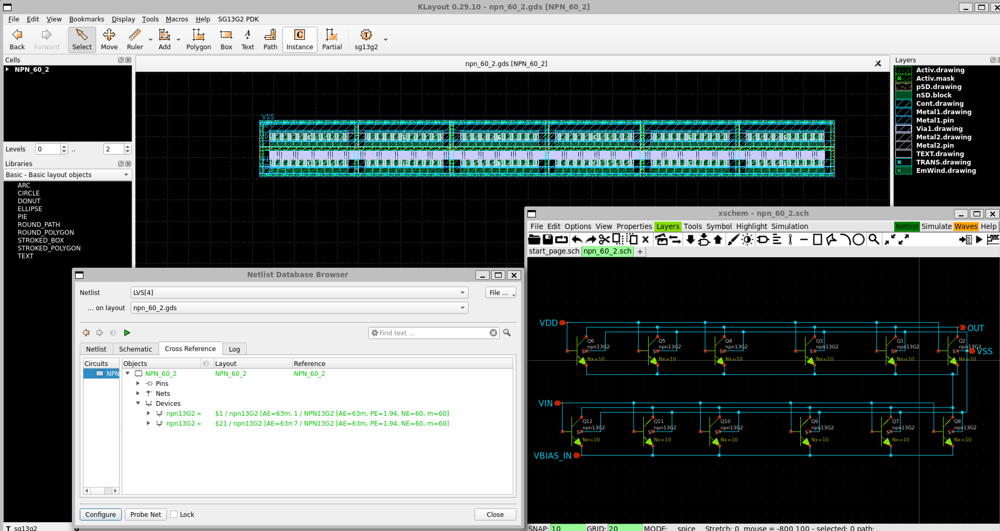
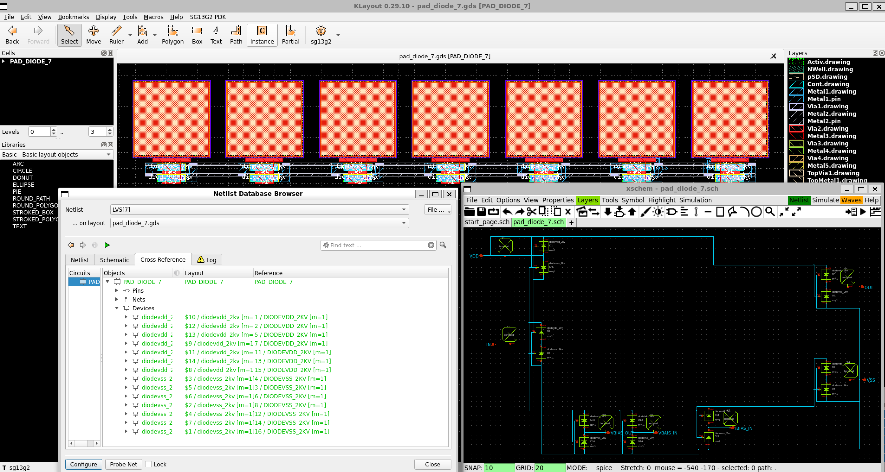

Validation of the LNA for GPS
#############################

DRC
***

All Green.

LVS
***

LVS was executed on a circuit and component-by-component basis.
In LVS, an error occurs when capacitors are connected in parallel, so LVS was performed with a version in which one of the capacitors was deleted if a capacitor connected in parallel was used. 
The inductors were also undetectable, so LVS was performed with a version that treated them as shorted. 

NPN based LNA without Inductor & ESD Pad : lna_npn_pad* files
===============================================================

NPN-based with external inductor is connected with Pad. 

- Schematic `lna_npn_pad.sch <https://github.com/noritsuna/GPS_LNA/raw/main/GPS_LNA/design_data/lvs/lna_npn_pad.sch>`_
- GDS `lna_npn_pad.gds <https://github.com/noritsuna/GPS_LNA/raw/main/GPS_LNA/design_data/lvs/lna_npn_pad.gds>`_
- Schematic deleted Capacitor `lna_npn_pad_lvs.sch <https://github.com/noritsuna/GPS_LNA/raw/main/GPS_LNA/design_data/lvs/lna_npn_pad_lvs.sch>`_
- GDS deleted Capacitor `lna_npn_pad_lvs.gds <https://github.com/noritsuna/GPS_LNA/raw/main/GPS_LNA/design_data/lvs/lna_npn_pad_lvs.gds>`_

NPN based LNA with Inductor : lna_full_base* files
====================================================

NPN-based with built-in inductor. 

- Schematic `lna_full_base.sch <https://github.com/noritsuna/GPS_LNA/raw/main/GPS_LNA/design_data/lvs/lna_full_base.sch>`_
- GDS `lna_full_base.gds <https://github.com/noritsuna/GPS_LNA/raw/main/GPS_LNA/design_data/lvs/lna_full_base.gds>`_
- Schematic deleted Capacitor & shorted Inductor `lna_full_base_lvs.sch <https://github.com/noritsuna/GPS_LNA/raw/main/GPS_LNA/design_data/lvs/lna_full_base_lvs.sch>`_
- GDS deleted Capacitor & shorted Inductor `lna_full_base_lvs.gds <https://github.com/noritsuna/GPS_LNA/raw/main/GPS_LNA/design_data/lvs/lna_full_base_lvs.gds>`_

NPN based LNA without Inductor : lna_npn_base* files
======================================================

NPN-based with external inductor. 

- Schematic `lna_npn_base.sch <https://github.com/noritsuna/GPS_LNA/raw/main/GPS_LNA/design_data/lvs/lna_npn_base.sch>`_
- GDS `lna_npn_base.gds <https://github.com/noritsuna/GPS_LNA/raw/main/GPS_LNA/design_data/lvs/lna_npn_base.gds>`_
- Schematic deleted Capacitor `lna_npn_base_lvs.sch <https://github.com/noritsuna/GPS_LNA/raw/main/GPS_LNA/design_data/lvs/lna_npn_base_lvs.sch>`_
- GDS deleted Capacitor `lna_npn_base_lvs.gds <https://github.com/noritsuna/GPS_LNA/raw/main/GPS_LNA/design_data/lvs/lna_npn_base_lvs.gds>`_

NMOS based LNA without Inductor : lna_nmons_base* files
=========================================================

NMOS-based with external inductor. 

- Schematic `lna_nmos_base.sch <https://github.com/noritsuna/GPS_LNA/raw/main/GPS_LNA/design_data/lvs/lna_nmos_base.sch>`_
- GDS `lna_nmos_base.gds <https://github.com/noritsuna/GPS_LNA/raw/main/GPS_LNA/design_data/lvs/lna_nmos_base.gds>`_
- Schematic deleted Capacitor `lna_nmos_base_lvs.sch <https://github.com/noritsuna/GPS_LNA/raw/main/GPS_LNA/design_data/lvs/lna_nmos_base_lvs.sch>`_
- GDS deleted Capacitor `lna_nmos_base_lvs.gds <https://github.com/noritsuna/GPS_LNA/raw/main/GPS_LNA/design_data/lvs/lna_nmos_base_lvs.gds>`_

Parts of the LNA for GPS for LVS
********************************

From this point forward, it is a component-by-component circuit and LVS. 

VBias : parts/vbias* files
============================

Circuit for VBias. 

- Schematic `vbias.sch <https://github.com/noritsuna/GPS_LNA/raw/main/GPS_LNA/design_data/lvs/parts/vbias.sch>`_
- GDS `vbias.gds <https://github.com/noritsuna/GPS_LNA/raw/main/GPS_LNA/design_data/lvs/parts/vbias.gds>`_

Impedance Matching : parts/inp* files
=======================================

Circuit for impedance matching. 

- Schematic `inp.sch <https://github.com/noritsuna/GPS_LNA/raw/main/GPS_LNA/design_data/lvs/parts/inp.sch>`_
- GDS `inp.gds <https://github.com/noritsuna/GPS_LNA/raw/main/GPS_LNA/design_data/lvs/parts/inp.gds>`_

VBias & Impedance Matching : parts/vbias_inp* files
=====================================================

A circuit that connects VBias circuit and Impedance Matching circuit. 

- Schematic `vbias_inp.sch <https://github.com/noritsuna/GPS_LNA/raw/main/GPS_LNA/design_data/lvs/parts/vbias_inp.sch>`_
- GDS `vbias_inp.gds <https://github.com/noritsuna/GPS_LNA/raw/main/GPS_LNA/design_data/lvs/parts/vbias_inp.gds>`_

NPN of NE=60 : parts/npn_60* files
====================================

NPN used in the LNA section. 

- Schematic `npn_60.sch <https://github.com/noritsuna/GPS_LNA/raw/main/GPS_LNA/design_data/lvs/parts/npn_60.sch>`_
- GDS `npn_60.gds <https://github.com/noritsuna/GPS_LNA/raw/main/GPS_LNA/design_data/lvs/parts/npn_60.gds>`_

NPN of NE=60 * 2 : parts/npn_60_2* files
==========================================

NPNs used in the LNA section are connected. 

- Schematic `npn_60_2.sch <https://github.com/noritsuna/GPS_LNA/raw/main/GPS_LNA/design_data/lvs/parts/npn_60_2.sch>`_
- GDS `npn_60_2.gds <https://github.com/noritsuna/GPS_LNA/raw/main/GPS_LNA/design_data/lvs/parts/npn_60_2.gds>`_

NMOS of W=200 : parts/nmos_200* files
=======================================

NMOS used in the LNA section. 

- Schematic `nmos_200.sch <https://github.com/noritsuna/GPS_LNA/raw/main/GPS_LNA/design_data/lvs/parts/nmos_200.sch>`_
- GDS `nmos_200.gds <https://github.com/noritsuna/GPS_LNA/raw/main/GPS_LNA/design_data/lvs/parts/nmos_200.gds>`_

NMOS of W=200 * 2 : parts/nmos_200_2* files
=============================================

NMOSs used in the LNA section are connected. 

- Schematic `nmos_200_2.sch <https://github.com/noritsuna/GPS_LNA/raw/main/GPS_LNA/design_data/lvs/parts/nmos_200_2.sch>`_
- GDS `nmos_200_2.gds <https://github.com/noritsuna/GPS_LNA/raw/main/GPS_LNA/design_data/lvs/parts/nmos_200_2.gds>`_

ESD Pad : parts/pad_diode* files
==================================

Pads utilizing 2kV withstand voltage diodes. 

- Schematic `pad_diode.sch <https://github.com/noritsuna/GPS_LNA/raw/main/GPS_LNA/design_data/lvs/parts/pad_diode.sch>`_
- GDS `pad_diode.gds <https://github.com/noritsuna/GPS_LNA/raw/main/GPS_LNA/design_data/lvs/parts/pad_diode.gds>`_

ESD Pad * 7 : parts/pad_diode_7* files
======================================= 

A circuit of the above Pad with 7 pieces side by side. 
Used in each circuit. 

- Schematic `pad_diode_7.sch <https://github.com/noritsuna/GPS_LNA/raw/main/GPS_LNA/design_data/lvs/parts/pad_diode_7.sch>`_
- GDS `pad_diode_7.gds <https://github.com/noritsuna/GPS_LNA/raw/main/GPS_LNA/design_data/lvs/parts/pad_diode_7.gds>`_

