Design data and design process description
############################################

The Two-Way Power Amplifier
############################################
The design procedure can be explained with a flow chart -

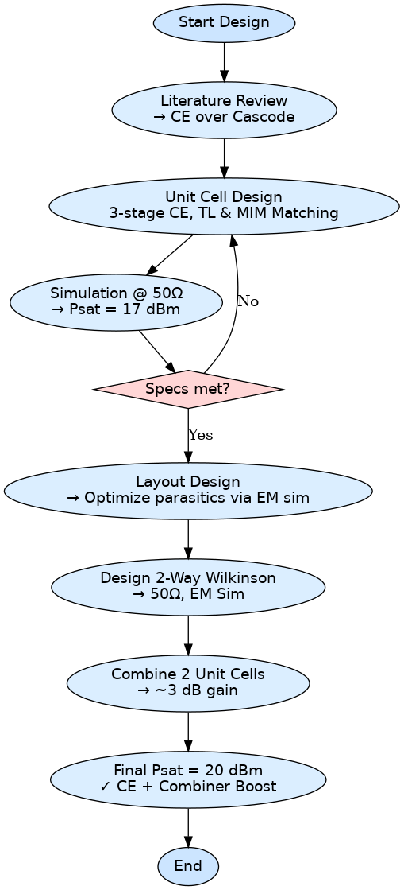

Design Procedure
##############################################

The design of the two-way power amplifier was driven by the goal of achieving a **high Psat at 180 GHz**, with the intention of **surpassing state-of-the-art results** using IHP’s 130 nm SiGe BiCMOS technology (SG13G2).

Based on literature review, **common emitter (CE)** configurations were selected over cascode or differential topologies, due to their superior large signal performance and higher achievable Psat. The **unit cell** was designed as a **three-stage single-ended CE amplifier** using HBT devices, with **transmission lines and MIM capacitors for impedance matching**. This configuration yielded a **Psat of 17 dBm**, simulated with 50-ohm matched ports.

To achieve a higher output power, two such unit cells were combined using a **Wilkinson power combiner** designed specifically for **180 GHz operation** with **50-ohm characteristic impedance**. The Wilkinson design was optimized through **EM simulations** to ensure minimal insertion loss and good isolation.

This approach is based on the principle that **power combining adds approximately 3 dB** of output power per doubling of unit cells. Therefore, two 17 dBm unit cells, when combined, theoretically yield **20 dBm Psat**, surpassing previously reported results using cascode configurations.

The design followed a **schematic-first flow**, followed by layout creation, and finally **layout-level EM simulations** to account for high-frequency parasitics and refine matching and combiner performance. This two-way amplifier structure serves as the foundation for scaling up to a **four-way PA**, with similar design and optimization philosophy.

Circuit Design
----------------------------------------------

The schematic of the Two-Way Power Amplifier is shown below:

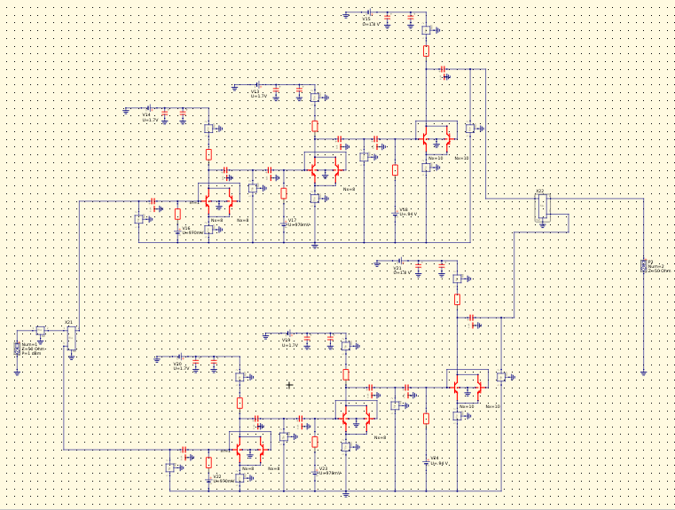

The core amplifier design is based on a **three-stage Common Emitter (CE) topology**, chosen for its superior large-signal performance and higher Psat at G-band frequencies. The amplifier is **single-ended** and employs **transmission lines and MIM capacitors** for matching and DC blocking.

The two amplifier chains are **identical**, and their outputs are combined using a **Wilkinson power combiner**, designed for **50-ohm characteristic impedance at 180 GHz**. Each amplifier chain includes:

- Three CE stages, each biased individually
- Inter-stage matching using short transmission lines and capacitors
- Stabilization resistors to maintain gain flatness and prevent oscillation

The amplifier is biased with:
- **VCC1 = 1.7 V**, **VCC2 = 1.8 V** for the collector supplies
- **VBB1 = 0.97 V**, **VBB2 = 0.94 V** for base biasing

Decoupling capacitors are used throughout the power supply and bias networks to suppress high-frequency noise and improve isolation between stages.

This schematic represents the **schematic-level implementation** prior to layout extraction and EM validation, and was the basis for initial simulations of gain, Psat, and stability. The schematic was simulated using 50-ohm input and output ports to estimate performance in a matched environment before proceeding to layout design.

Layout Design
----------------------------------------

The complete layout view of the Two-Way Power Amplifier is shown below:

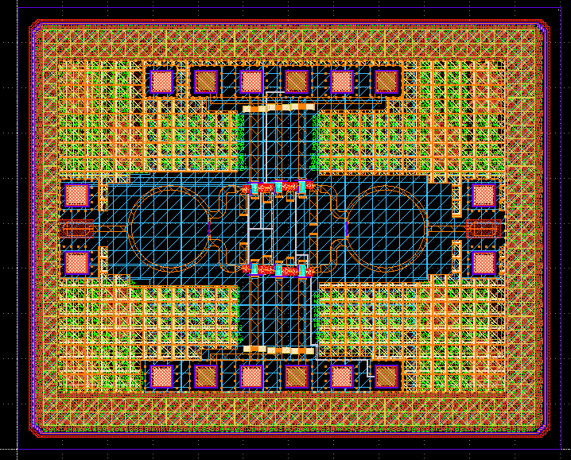

The layout was designed following the schematic architecture with careful attention to **high-frequency parasitics** common at **G-band frequencies (180 GHz)**. The structure incorporates:

- **Two parallel unit cells**, symmetrically arranged to ensure consistent phase and power distribution
- A central **Wilkinson power combiner** for merging the outputs
- **Dedicated routing** of VCC1, VCC2, VBB1, and VBB2 lines to each stage of both amplifier chains
- **Wide metal traces and multi-layer routing** for RF signal integrity and thermal handling

Each RF input/output path includes **transmission lines optimized through EM simulation**, and pad access is provided through **GSG (Ground–Signal–Ground) pads** for both the input and output sides.

This layout was used to perform **EM simulations and layout-versus-schematic (LVS) checks**, which validated that the designed RF paths and biasing networks met required specs and matched the original schematic behavior.

Simulated Results
###########################################################

S-Parameters
------------------------------------

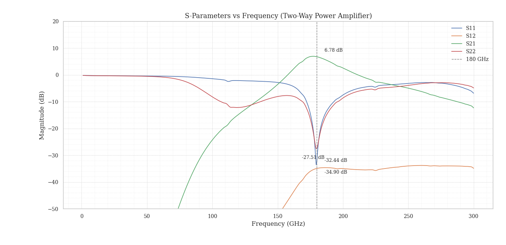

The S-parameter simulation of the Two-Way Power Amplifier was carried out to evaluate the small-signal performance at and around the target operating frequency of **180 GHz**.

- **S21** (Gain): Peaks at **6.78 dB**, indicating successful power combining with a moderate insertion gain.
- **S11** and **S22**: Both are below **–27 dB** at 180 GHz, indicating excellent input and output matching.
- **S12**: Isolation is below **–34 dB**, reflecting strong unidirectionality and good port-to-port isolation.

This validates the matching, combining, and gain objectives of the layout-level amplifier. Minimal return loss and excellent isolation confirm that the Wilkinson combiner performs well in the designed frequency band.

Large Signal Analysis (Unit Cell)
----------------------------------------------

As Qucs-S does not support full large-signal harmonic balance simulations with multiple instances and EM elements, the large-signal analysis was carried out only for the **single unit cell** to estimate **Gain Compression and Psat**.
To estimate output power, a **transient simulation** of the unit cell was performed, followed by a **Fourier transformation** of the output waveform. This allowed extraction of the **fundamental frequency component (180 GHz)** and its corresponding magnitude, which was then used to calculate the output power in dBm.

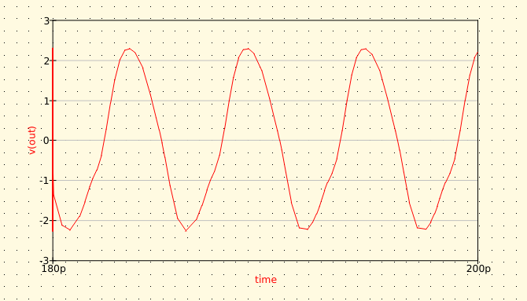

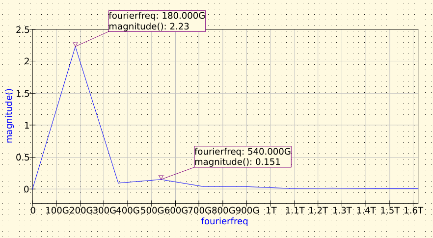
    
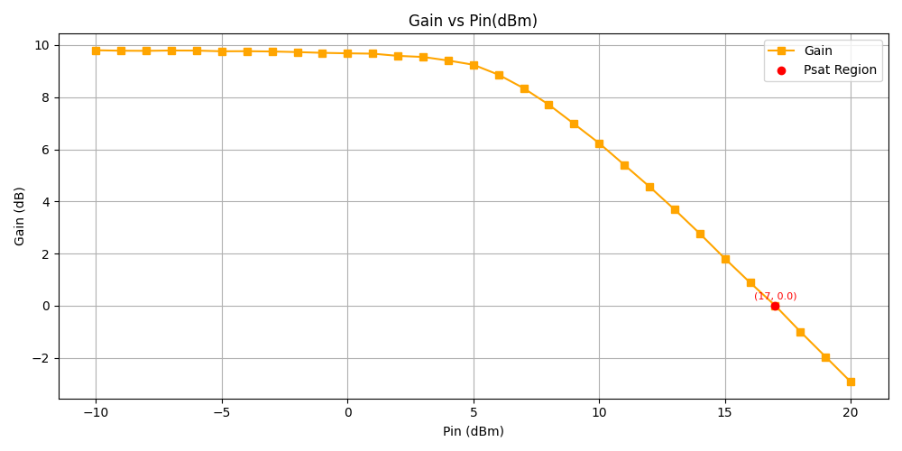

The Gain vs Pin plot shows:
- A nearly flat gain of ~9.8 dB up to ~10 dBm input
- Clear **gain compression** beyond 12 dBm
- **Psat** region begins at **Pin ≈ 17 dBm**, where gain drops to 0 dB

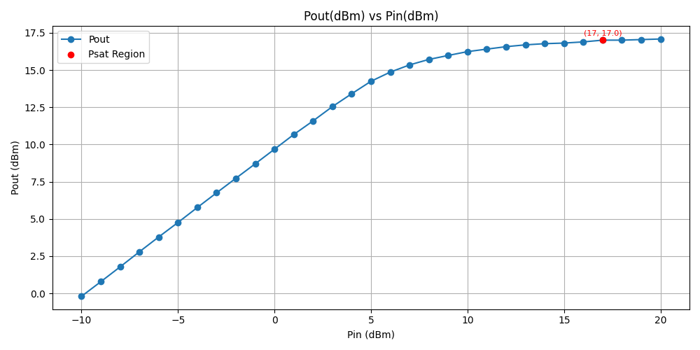

The Pout vs Pin plot confirms:
- Output power increases linearly up to **17 dBm**
- Saturation occurs around **Pin = 17 dBm**, hence **Psat ≈ 17 dBm**

Assuming ideal power combining through Wilkinson structures, the expected **Psat of the Two-Way PA is ~20 dBm**, i.e., ~3 dB increase from the unit cell, which is consistent with theoretical expectations for a power-combined architecture.

Stability Parameters
----------------------------------------

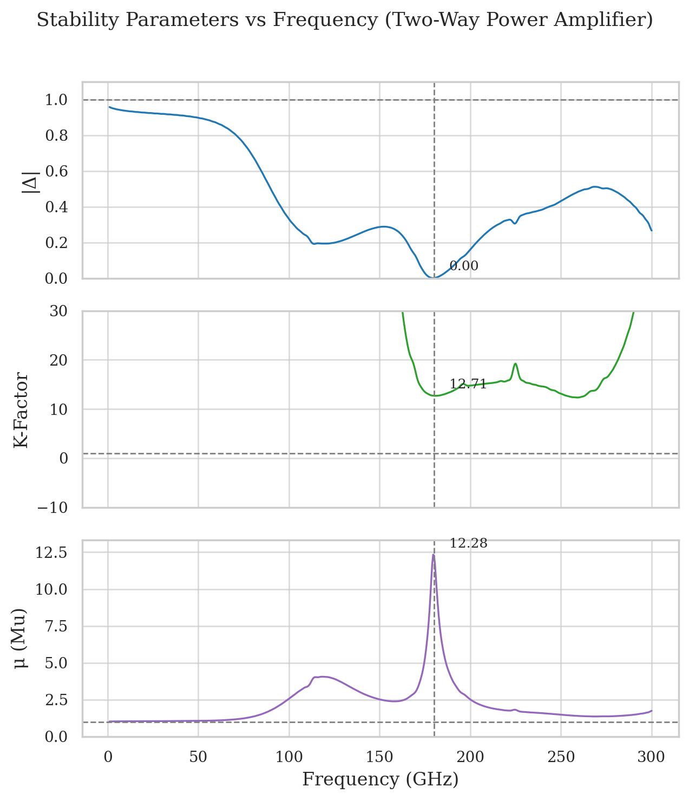

The small-signal stability of the Two-Way Power Amplifier was evaluated across a wide frequency range using three key parameters:

- **Δ (Delta)**: The determinant of the scattering matrix. A value of **|Δ| < 1** is necessary for unconditional stability. The design maintains Δ well below 1 at the target frequency (180 GHz), ensuring passive stability.
  
- **K-Factor (Rollett Stability Factor)**: A value of **K > 1** is required for unconditional stability. At 180 GHz, the K-factor is **12.71**, far exceeding the minimum threshold.
  
- **μ (Mu Stability Factor)**: Also used to confirm unconditional stability. The design shows **μ ≈ 12.28** at 180 GHz, confirming strong margin of stability.

All three metrics confirm that the amplifier is **unconditionally stable across the operating band** and far beyond it, even up to 300 GHz. The use of interstage resistive loading, proper layout grounding, and decoupling elements contributed significantly to this performance.

Pad Layout
----------------------------------------

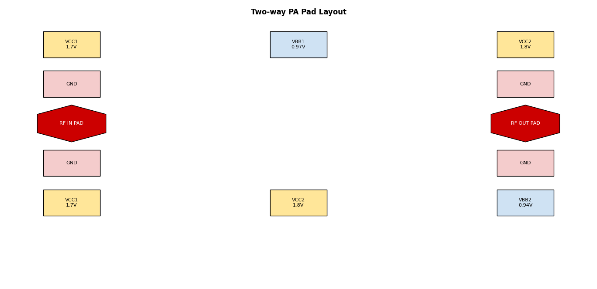

The pad layout was designed to ensure robust and organized connectivity to power rails, signal paths, and bias networks. The orientation is kept symmetric for efficient routing and minimal parasitic coupling.

**Pad Allocation:**

- **Left Side (Top to Bottom)**:
  - VCC1 (1.7V)
  - GND
  - RF IN PAD
  - GND
  - VCC1 (1.7V)

- **Right Side (Top to Bottom)**:
  - VCC2 (1.8V)
  - GND
  - RF OUT PAD
  - GND
  - VBB2 (0.94V)

- **Top Side**:
  - VBB1 (0.97V)

- **Bottom Side**:
  - VCC2 (1.8V)

The RF pads are **hexagonal** and placed mid-height for symmetric probe access in a GSG (Ground-Signal-Ground) configuration. All power and bias pads are **square** and colored according to standard convention: red for RF, yellow for VCC, blue for bias, and pink for ground. The pad pitch and spacing are designed to be compatible with high-frequency wafer probes.

The Four-Way Power Amplifier
##############################################

The design procedure can be explained with a flow chart -

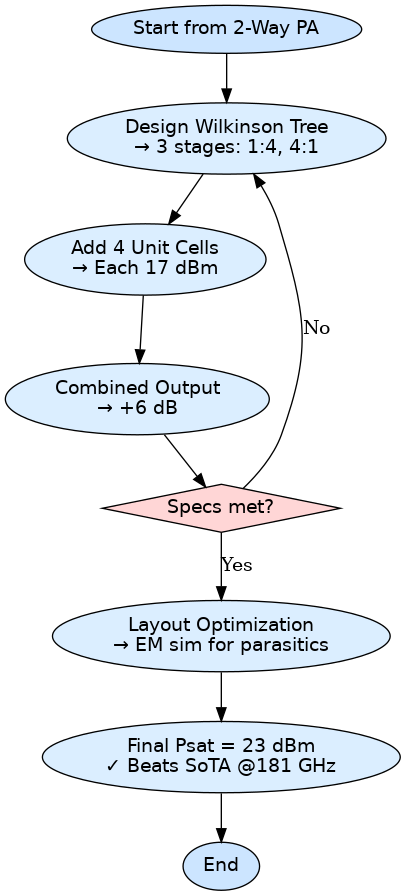

Design Procedure
##############################################

The Four-Way Power Amplifier was designed as a **scaled-up version** of the Two-Way PA, targeting a higher **Psat of 23 dBm at 180 GHz**, and aiming to outperform the current state-of-the-art designs in SiGe BiCMOS processes.

Building upon the validated performance of the **three-stage common emitter unit cell** (17 dBm Psat) and the **Two-Way Wilkinson-combined amplifier** (20 dBm), the Four-Way PA was realized by integrating **four identical unit cells**, fed and merged using a **hierarchical Wilkinson power splitter/combiner**.

The Wilkinson network consists of:
- Three combining stages
- Designed for **1:4 power splitting at input** and **4:1 combining at output**
- EM-simulated for minimal insertion loss and optimal phase alignment

The design process involved:
1. Replicating the **unit cell design** (with matching networks)
2. Expanding the combiner architecture to handle 4-way signal routing
3. Ensuring **equal path lengths and load symmetry**
4. Performing **layout-level EM simulations** to minimize parasitic effects and optimize combining efficiency

Theoretically, each doubling of unit cells provides a **+3 dB boost** in Psat. With four units, the output power adds up to **23 dBm**, effectively surpassing the 18.1 dBm reported in state-of-the-art 4-way cascode-based designs. The CE-based approach offers **simpler implementation, compact area**, and strong performance at G-band.

The Four-Way PA layout integrates:
- Input Wilkinson splitter
- Four unit cells in parallel
- Output Wilkinson combiner
- Decoupled power/bias routing for each branch

Circuit Design
----------------------------------------------

The schematic of the Four-Way Power Amplifier is shown below:

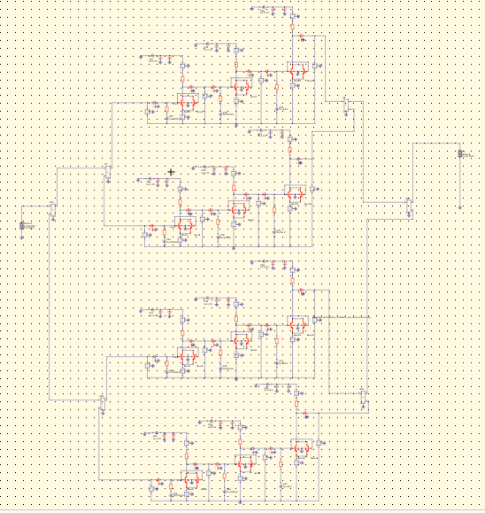

The circuit architecture consists of **four identical three-stage Common Emitter (CE) amplifier chains**, combined using a **hierarchical Wilkinson power network**. This design extends the validated Two-Way PA schematic, doubling the number of unit cells to achieve higher output power while maintaining layout symmetry and electrical balance.

Each CE amplifier chain includes:
- Three single-ended stages with **inter-stage matching using transmission lines and MIM capacitors**
- Separate bias paths for each stage: **VBB1 (0.97 V)** and **VBB2 (0.94 V)**
- Power rails: **VCC1 (1.7 V)** and **VCC2 (1.8 V)** delivered to each amplifier in a distributed manner

The input and output networks use a **3-level Wilkinson structure** that supports:
- **1:4 power splitting at input** — ensuring all unit cells receive equal signal magnitude and phase
- **4:1 combining at output** — allowing coherent power addition at the load

Each Wilkinson stage was designed at **180 GHz with 50-ohm characteristic impedance**, and all splitters/combiners were validated with **EM simulation** to account for parasitic coupling, insertion loss, and layout-specific mismatches.

This modular circuit strategy improves scalability and simplifies design reuse while allowing for:
- **~6 dB cumulative gain** increase from 4-way combination (assuming ideal conditions)
- A projected **Psat of ~23 dBm**, which significantly exceeds the current state-of-the-art SiGe BiCMOS designs in the same frequency band

Layout Design
----------------------------------------

The layout of the Four-Way Power Amplifier is shown below:

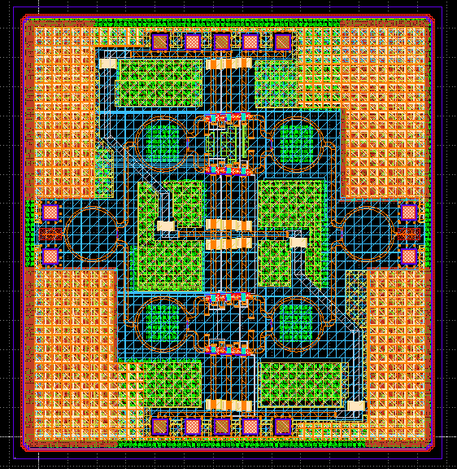

The layout extends the structure of the Two-Way PA by incorporating:

- **Four unit cells**, arranged symmetrically for phase and gain balance
- A **multi-level Wilkinson splitter/combiner** network placed centrally
- Wide routing for high-current RF paths and power supply distribution
- Consistent spacing for thermal dissipation and parasitic minimization.

Simulated Results
###########################################################

S-Parameters
------------------------------------

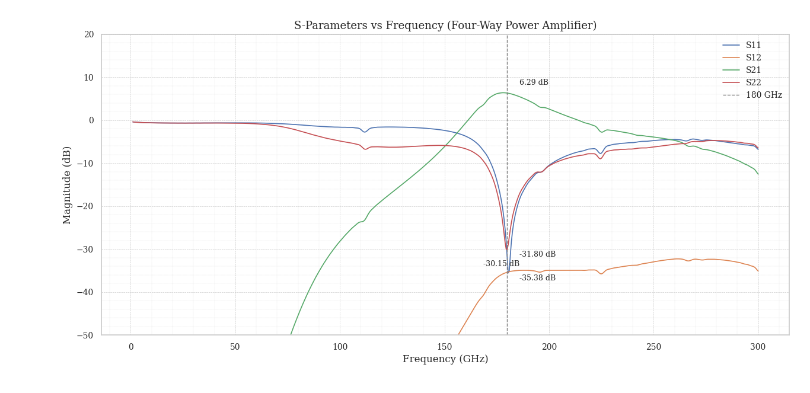

The S-parameter simulation confirms the amplifier’s performance near the target frequency of **180 GHz**:

- **S21 (Gain)**: ~6.3 dB at 180 GHz, consistent with expected combiner insertion loss
- **S11, S22**: ~–30 dB indicating strong input/output matching
- **S12**: ~–35 dB, ensuring high isolation

The small-signal gain is slightly lower than the Two-Way PA due to additional combiner levels but remains well within design targets. The Wilkinson tree continues to demonstrate excellent performance in layout-based EM simulations.

Stability Parameters
----------------------------------------

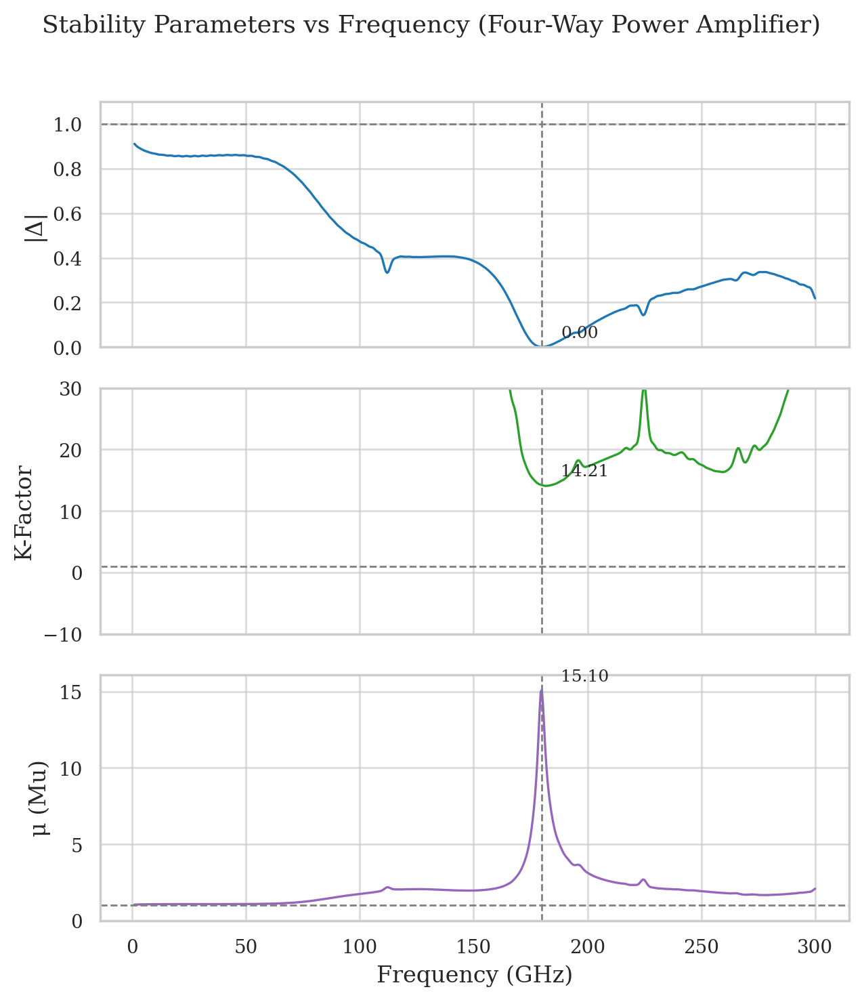

Stability analysis indicates:

- **|Δ| < 1** across the entire band
- **K-Factor = 14.21** and **μ = 15.10** at 180 GHz

The amplifier remains **unconditionally stable** through 300 GHz. Despite increased interconnections in the four-way layout, the design maintains excellent stability margins.

Large Signal Estimation (Theoretical)
----------------------------------------

Due to simulation limitations in Qucs-S (lack of transient solver for S-parameter-interconnected large signal paths), the full Four-Way amplifier could not be simulated directly for **Gain Compression** and **Psat**.

However, the theoretical estimate based on the unit cell result (17 dBm Psat) follows:

- Two-way PA: **+3 dB → 20 dBm**
- Four-way PA: **+3 dB more → 23 dBm**

Thus, the expected **Psat = 23 dBm**, which **surpasses the 18.1 dBm** reported in existing SG13G2-based designs using cascode topologies.

Pad Layout
----------------------------------------

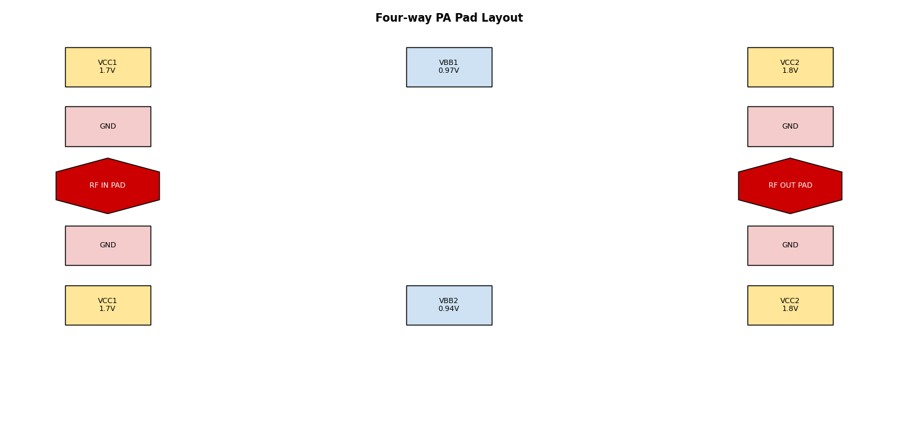

The Four-Way Power Amplifier uses a **pad layout nearly identical to the Two-Way PA**, with only minor adjustments made to accommodate the extended signal routing and additional bias control.

- **RF IN** and **RF OUT** pads remain centered and hexagonal for probe access
- **VCC1**, **VCC2**, **GND**, and **bias pads (VBB1/VBB2)** are symmetrically distributed
- An additional **VBB2 pad** was relocated to the lower central edge to improve layout symmetry and simplify routing