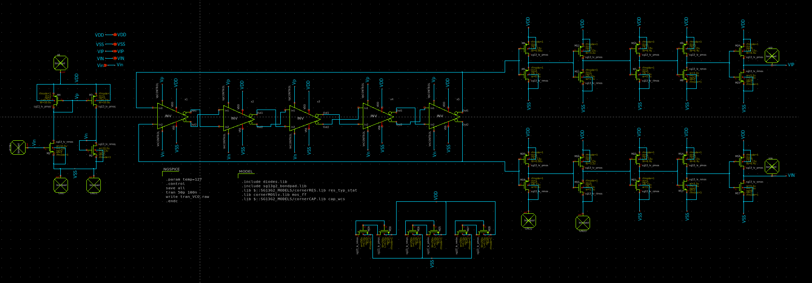
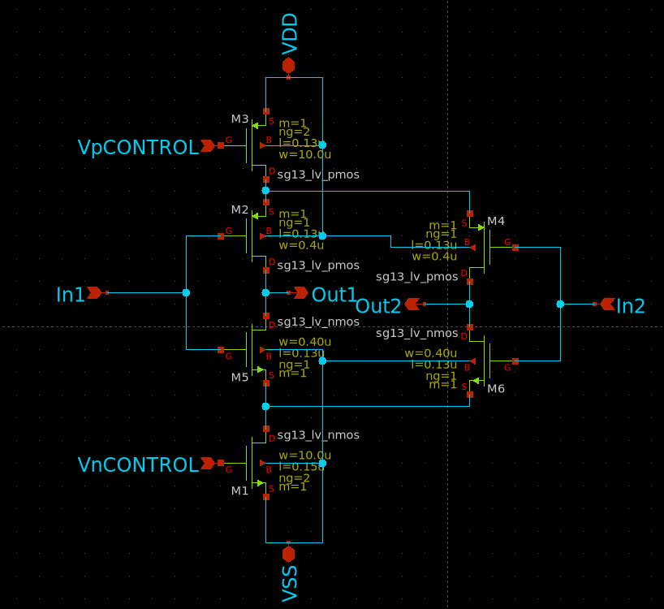

# Voltage-Controlled Oscillator
-------------------------------
This document describes the design and specifications of a Voltage-Controlled Oscillator (VCO). The VCO is a key component in communication systems and is used in various applications, such as radio signal generation and frequency control.

The design was carried out with a focus on efficiency and performance, and includes the development of schematics, layout, and technical specifications. The following images illustrate the details of the circuit, final layout, and the main characteristics of the VCO.

## VCO's Schematic

## VCO's Inverter

| **Parameter**                   | **Value**               |
|---------------------------------|-------------------------|
| **Frequency Range**             | 2.64 GHz                |
| **Supply Voltage (Vdd)**        | 1.21 V                  |
| **Operating Temperature**       | -269°C                  |

