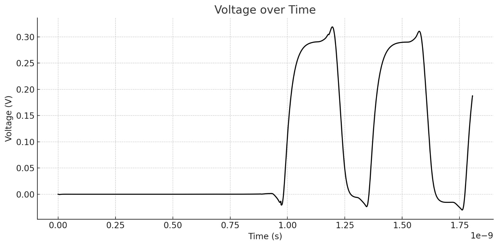

# Voltage-Controlled Oscillator
-------------------------------
## Volidation
The output signal of the Voltage-Controlled Oscillator (VCO) was simulated over time. The following graph illustrates the voltage response of the VCO. As seen in the plot, the voltage stabilizes after an initial transient period and oscillates within the expected frequency range.

This signal validates the expected behavior of the VCO under the specified operating conditions.

