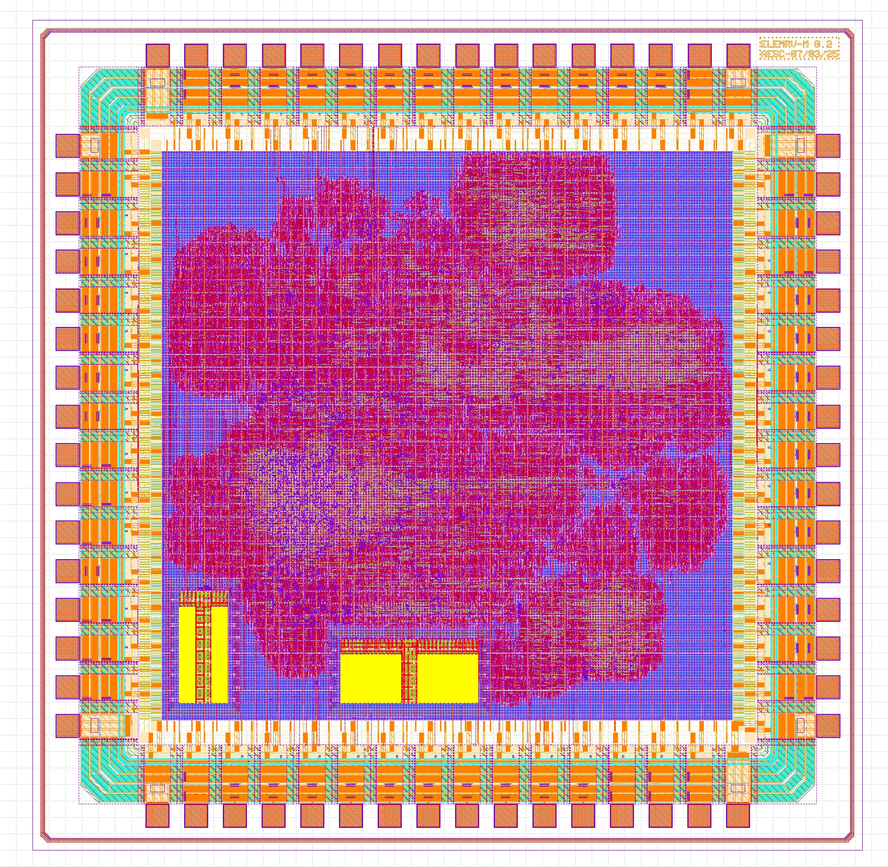

ElemRV - End-to-end Open-Source RISC-V MCU
==========================================

Welcome to the documentation for the end-to-end Open-Source RISC-V Microcontroller!

This guide is organized into the following chapters:

.. toctree::
   :maxdepth: 1

   design.rst
   pinout.rst
   rev2.rst
   rev1.rst
