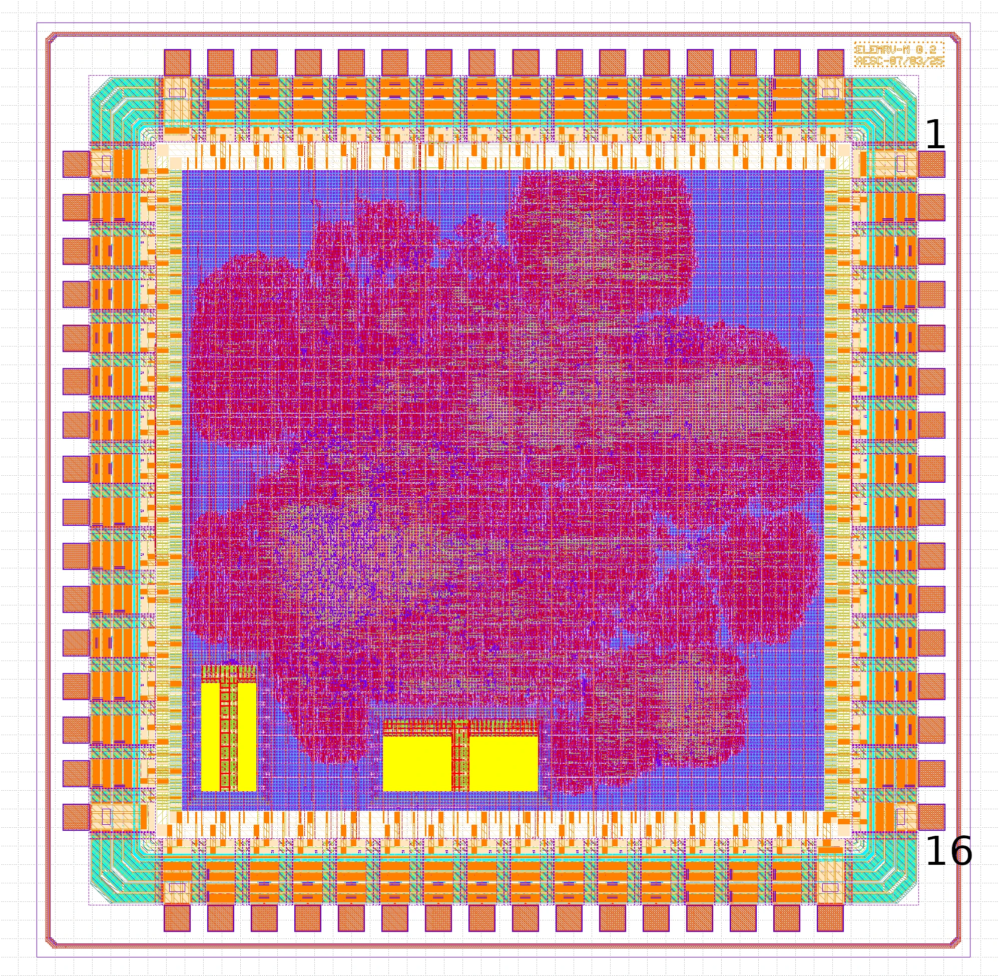

Chip Pin-Out
============

The image below highlights the location of pin 1 on the chip.

The table that follows provides a detailed explanation of each I/O pin's function.

.. list-table:: Pin-Out
   :stub-columns: 1

   * - Pin
     - Position
     - Name
     - IO
     - Function

   * - 1
     - East
     - Vdd
     -
     - 1.2V
   * - 2
     - East
     - Vss
     -
     - GND
   * - 3
     - East
     - io_hyperbus_ck
     - O
     - HyperBus Clock
   * - 4
     - East
     - FFU
     -
     - For Future Use
   * - 5
     - East
     - io_pins_6
     - IO
     - GPIO0_6 / PIO0_1
   * - 6
     - East
     - io_pins_7
     - IO
     - GPIO0_7 / PIO0_2
   * - 7
     - East
     - io_pins_8
     - IO
     - GPIO0_8 / PWM0_0
   * - 8
     - East
     - io_pins_9
     - IO
     - GPIO0_9 / PWM0_1
   * - 9
     - East
     - io_spi_dq_0
     - IO
     - SPI Data Out
   * - 10
     - East
     - io_spi_dq_1
     - IO
     - SPI Data In
   * - 11
     - East
     - io_spi_dq_2
     - IO
     - Not Used!
   * - 12
     - East
     - io_spi_dq_3
     - IO
     - Not Used!
   * - 13
     - East
     - io_spi_sck
     - O
     - SPI Clock
   * - 14
     - East
     - io_spi_cs
     - O
     - SPI Chip Select
   * - 15
     - East
     - IOVss
     -
     - Ground
   * - 16
     - East
     - IOVdd
     -
     - 3.3V

   * - 17
     - South
     - Vdd
     -
     - 1.2V
   * - 18
     - South
     - Vss
     -
     - Ground
   * - 19
     - South
     - io_cock
     - I
     - Chip Clock Signal - 25 MHz
   * - 20
     - South
     - io_reset
     -
     - Chip Reset Signal - active-low
   * - 21
     - South
     - io_pins_19
     - IO
     - GPIO0_19 / UART1_RX
   * - 22
     - South
     - io_pins_18
     - IO
     - GPIO0_18 / UART1_TX
   * - 23
     - South
     - io_pins_17
     - IO
     - UART0_RTS / GPIO0_17
   * - 24
     - South
     - io_pins_16
     - IO
     - UART0_CTS / GPIO0_16
   * - 25
     - South
     - io_pins_15
     - IO
     - UART0_RX / GPIO0_15
   * - 26
     - South
     - io_pins_14
     - IO
     - UART0_TX / GPIO0_14
   * - 27
     - South
     - io_pins_13
     - IO
     - GPIO0_13 / SQPI0_DQ1
   * - 28
     - South
     - io_pins_12
     - IO
     - GPIO0_12 / SPI0_DQ0
   * - 29
     - South
     - io_pins_11
     - IO
     - GPIO0_11 / SPI0_SCLK
   * - 30
     - South
     - io_pins_10
     - IO
     - GPIO0_10 / SPI0_CS0
   * - 31
     - South
     - IOVss
     -
     - Ground
   * - 32
     - South
     - IOVdd
     -
     - 3.3V

   * - 33
     - West
     - Vdd
     -
     - 1.2V
   * - 34
     - West
     - Vss
     -
     - Ground
   * - 35
     - West
     - io_jtag_tms
     - I
     - JTAG TMS
   * - 36
     - West
     - io_jtag_tdi
     - I
     - JTAG Data In
   * - 37
     - West
     - io_jtag_tdo
     - O
     - JTAG Data Out
   * - 38
     - West
     - io_jtag_tck
     - I
     - JTAG Clock
   * - 39
     - West
     - FFU
     -
     - For Future Use
   * - 40
     - West
     - FFU
     -
     - For Future Use
   * - 41
     - West
     - io_pins_0
     - IO
     - GPIO0_0 / I2C0_SCL
   * - 42
     - West
     - io_pins_1
     - IO
     - GPIO0_1 / I2C0_SDA
   * - 43
     - West
     - io_pins_2
     - IO
     - GPIO0_2 / I2C0_INTERRUPT_0
   * - 44
     - West
     - io_pins_3
     - IO
     - GPIO0_3 / I2C1_SCL
   * - 45
     - West
     - io_pins_4
     - IO
     - GPIO0_4 / I2C1_SDA
   * - 46
     - West
     - io_pins_5
     - IO
     - GPIO0_5 / PIO0_0
   * - 47
     - West
     - IOVss
     -
     - Ground
   * - 48
     - West
     - IOVdd
     -
     - 3.3V

   * - 49
     - North
     - Vdd
     -
     - 1.2V
   * - 50
     - North
     - Vss
     -
     - Ground
   * - 51
     - North
     - io_hyperbus_dq_0
     - IO
     - Hyperbus Data
   * - 51
     - North
     - io_hyperbus_dq_1
     - IO
     - Hyperbus Data
   * - 51
     - North
     - io_hyperbus_dq_2
     - IO
     - Hyperbus Data
   * - 51
     - North
     - io_hyperbus_dq_3
     - IO
     - Hyperbus Data
   * - 51
     - North
     - io_hyperbus_dq_4
     - IO
     - Hyperbus Data
   * - 51
     - North
     - io_hyperbus_dq_5
     - IO
     - Hyperbus Data
   * - 51
     - North
     - io_hyperbus_dq_6
     - IO
     - Hyperbus Data
   * - 51
     - North
     - io_hyperbus_dq_7
     - IO
     - Hyperbus Data
   * - 51
     - North
     - io_hyperbus_reset
     - O
     - Hyperbus Reset
   * - 51
     - North
     - io_hyperbus_rwds
     - IO
     - Hyperbus Read Write Data Strobe
   * - 51
     - North
     - io_hyperbus_cs_0
     - O
     - Hyperbus Chip Select 0
   * - 51
     - North
     - io_hyperbus_cs_1
     - O
     - Hyperbus Chip Select 1
   * - 47
     - North
     - IOVss
     -
     - Ground
   * - 48
     - North
     - IOVdd
     -
     - 3.3V
